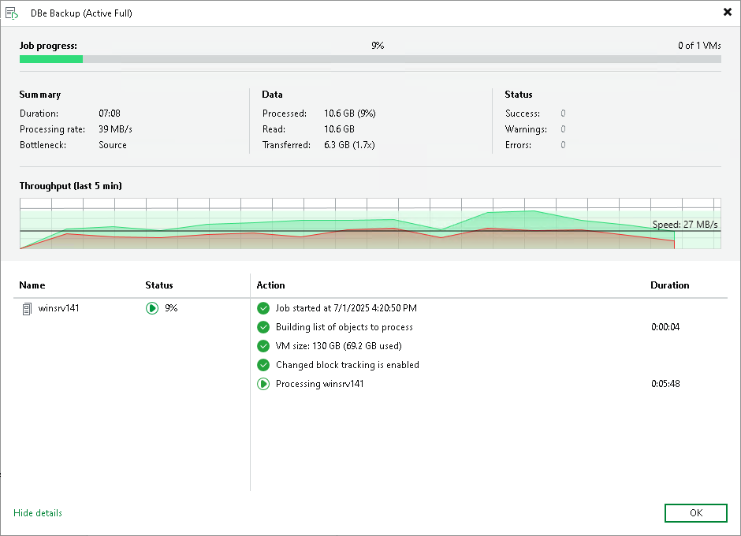

# Viewing Job Session Results

You can view detailed statistics on every job session.

To view statistics for a selected job session, do either of the following:

* Open the [Viewing History Statistics](history_statistics_hv.md) view. In the inventory pane, select Jobs. In the working area, double-click the necessary job session.
* Open the [Viewing History Statistics](history_statistics_hv.md) view. In the inventory pane, select Jobs. In the working area, right-click the necessary job session and select Statistics.

|  |
| --- |
| Tip |
| To switch between past job sessions, use left and right arrow keys on the keyboard. |

Statistics Counters

Veeam Backup & Replication displays backup job statistics for the following counters:

* The Job progress bar shows the percentage of job completion.
* The Summary box shows general information about the job:

+ Duration — duration of the job session.
+ Processing rate — average speed of VM data processing. This counter is a ratio between the amount of data that has actually been read and the time it took to process the data. Note that only the data transfer time is used for the calculation and the job's runtime is irrelevant.
+ Bottleneck — a bottleneck in the data transmission process. To learn more about bottlenecks, see [Performance Bottlenecks](detecting_bottlenecks.md).

* The Data box shows information about processed VM data:

+ Processed — total size of all VM disks processed by the job.
+ Read — the amount of data read from the volume before compression and deduplication. For incremental job runs, the value of this counter is typically lower than the value of the Processed counter. Veeam Backup & Replication reads only data blocks that have changed since the last job session, processes and copies these data blocks to the target.
+ Transferred — the amount of data transferred from the source-side [Veeam Data Mover](veeam_transport_service.md) to the target-side Veeam Data Mover after applying compression and deduplication. This counter does not directly indicate the size of the resulting files. Depending on the backup infrastructure and job settings, Veeam Backup & Replication can perform additional activities with data: deduplicate data, decompress data prior to writing the file to disk, and so on. The activities can impact the size of the resulting file.

* The Status box shows information about the job results. This box informs how many tasks have been completed with the Success, Warning and Error statuses (1 task per 1 VM):

* Success — the task is completed successfully.
* Warning — the task is completed with some minor errors. Depending on the nature of the errors, the backup data may not be consistent.
* Error — the task is not completed due to a blocking error.

* The pane in the lower-left corner shows a list of objects processed by the job.
* The pane in the lower-right corner shows a list of operations performed during the session. To see a list of operations for a specific object, click the object in the pane on the left. To see a list of operations for the whole copy session, click anywhere on the blank area in the left pane.

Colored Graph

To visualize the data transfer process, Veeam Backup & Replication displays a colored graph in the real-time statistics window:

* The green area defines the amount of data read from the source.
* The brown area defines the amount of data transported to the target.
* The horizontal line defines the current data processing speed.

If the job session is still being performed, you can click the graph to view the data rate for the last 5 minutes or the whole processing period. If the job session has already ended, the graph will display information for the whole processing period only.

The colored graph is displayed only for the currently running job session or the latest job session. If you open real-time statistics for past sessions other than the latest one, the colored graph will not be displayed.

