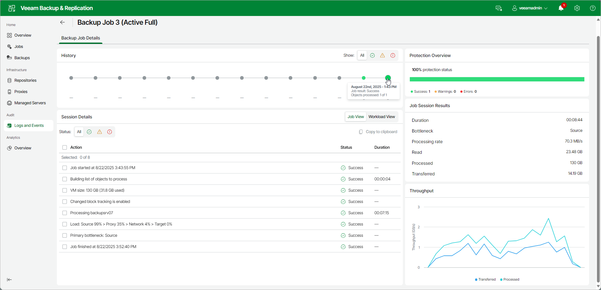

# Viewing Job Session Results

In this article

You can view detailed statistics on every job session.

To view statistics for a selected job session, do either of the following:

* Open the Jobs node in the management pane. In the working area, select the necessary job and click Details. In the History box, click the necessary job session.
* Open the [Logs and Events](history_statistics_hv_web.md) node. In the working area, select the necessary job and click its Status. In the History box, click the necessary job session.

Statistics Counters

Veeam Backup & Replication displays backup job statistics for the following counters:

* The History box shows a recent activity timeline of your backup job. Each green dot represents a successful backup made on that date. Use the filter buttons to show all backups, only successful ones, warnings or errors.

* The Protection Overview box indicates percentage of protected workloads in the job last run.

* The Session Details box shows the list of actions performed.

+ The Job View tab in the upper-right corner shows a list of operations performed during the job. To see a list of operations for a specific object included in the job, click the object in the pane on the left. To see a list of operations for the entire job, click anywhere on the blank area in the left pane.
+ The Workload View tab in the upper-right corner shows a list of objects processed by the job.
+ The Status box shows information about the job results. This box informs how many tasks have been completed with the Success, Warning and Failed statuses (1 task per 1 VM).

* Success — the task is completed successfully.
* Warning — the task is completed with minor errors. Depending on the nature of the errors, the backup data may not be consistent.
* Failed — the task is not completed due to a blocking error.

* The Job Session Results box shows general information about the job:

+ Duration — time from the job start till the current moment or job end.
+ Bottleneck — a bottleneck in the data transmission process. To learn about job bottlenecks, see [Performance Bottlenecks](detecting_bottlenecks.md).
+ Processing rate — average speed of VM data processing. This counter is a ratio between the amount of data that has actually been read and the time it took to process the data. Note that only the data transfer time is used for the calculation, and the job's runtime is irrelevant.

+ Read — the amount of data read from the datastore by the source-side Data Mover prior to applying compression and deduplication. For incremental job runs, the value of this counter is typically lower than the value of the Processed counter. Veeam Backup & Replication reads only data blocks that have changed since the last job session, processes and copies these data blocks to the target.
+ Processed — total size of all VM disks processed by the job.
+ Transferred — the amount of data transferred from the source-side Veeam Data Mover to the target-side Veeam Data Mover after applying compression and deduplication. This counter does not directly indicate the size of the resulting files. Depending on the backup infrastructure and job settings, Veeam Backup & Replication can perform additional activities with data: deduplicate data, decompress data prior to writing the file to disk, and so on. The activities can impact the size of the resulting file.

Colored Graph

To visualize the backup job progress, Veeam Backup & Replication displays a colored graph in the Throughput box:

* The light blue Processed line defines the amount of processed data.
* The dark blue Transferred line defines the amount of data transferred from the source-side Veeam Data Mover to the target-side Veeam Data Mover.

If the job session is still being performed, you can click the graph to view the data rate for the last 5 minutes or the whole processing period. If the job session has already ended, the graph displays information for the whole processing period only.

The colored graph is displayed only for the currently running job session or the latest job session. If you open real-time statistics for sessions other than the latest one, the colored graph will not be displayed.

Page updated 9/16/2025

Page content applies to build 13.0.1.1071
