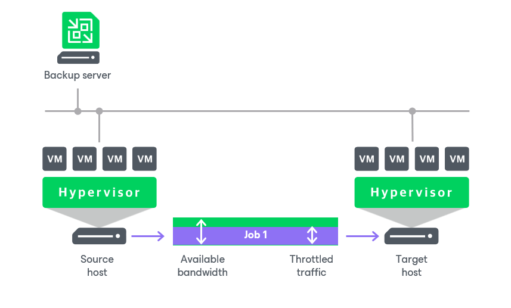
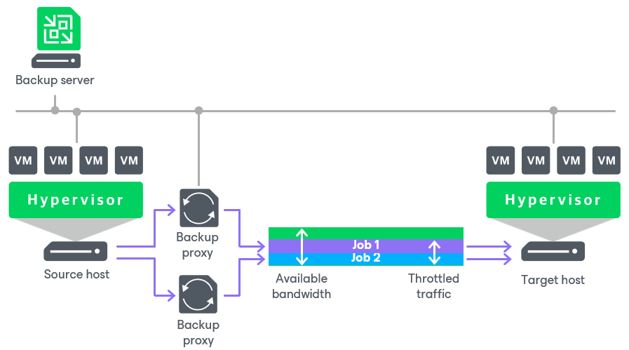
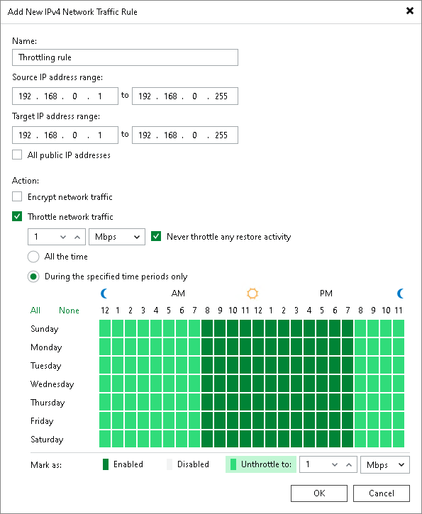

# Enabling Traffic Throttling

In this article

Traffic throttling setting in a network rule allows you to limit the impact of Veeam Backup & Replication tasks on network performance. Traffic throttling prevents jobs from utilizing the entire bandwidth available in your environment and makes sure that other network operations get enough traffic.

When several jobs that fall into the same network rule run simultaneously, Veeam Backup & Replication equally splits the throttled traffic between them. For example, if two jobs run at a time, each job gets half of the throttled traffic. Once one job finishes, the other gets the entire bandwidth allowed by the rule.

|  |
| --- |
| Note |
| Consider the following:   * Traffic can be throttled only if the [infrastructure components](#components) are located on different servers and have different IP addresses. For example, if you use the same server as a backup proxy and a backup repository, traffic throttling rules do not apply to them. * It is recommended that you throttle network traffic if you perform off-site backup or replicate VMs to a DR site over slow WAN links. * Traffic throttling rules apply to the transfer of virtual disks. At the beginning of the job, you may see bandwidth usage peaks caused by transferring other VM files. |

Infrastructure Components

Traffic can be throttled between the backup infrastructure components on which [Veeam Data Movers](veeam_transport_service.md) are deployed, also capacity tier of the scale-out backup repository and object storage repository. The components differ depending on a scenario. The following table shows this dependency.

| Scenario | Components |
| --- | --- |
| Backup to a Microsoft Windows or Linux-based backup repository\* | VMware backup proxy, backup proxy (onhost or offhost), and backup repository. |
| Backup to an SMB (CIFS) and NFS shares, Dell Data Domain and HPE StoreOnce\* | VMware backup proxy, backup proxy (onhost or offhost), and gateway server. |
| Backup to an [object storage repository](object_storage_repository.md) (the direct connection mode)\*\* | Backup proxy and object storage repository. |
| Backup to an [object storage repository](object_storage_repository.md) (using a gateway server)\*\* | Backup proxy and gateway server. |
| Backup to a [Veeam Cloud Connect repository](veeam_cloud_connect.md) | Backup proxy and [cloud gateway server](https://helpcenter.veeam.com/docs/vbr/cloud/cloud_connect_gateway.html?ver=13). |
| [CDP](cdp_replication.md) | Source and target CDP proxies. |
| [VM copy](vm_copy.md) | Backup proxy and backup repository. |
| [Backup copy](backup_copy.md)\* | Source and target backup repositories, gateway servers or WAN accelerators (if they are involved in the backup copy process). |
| [Replication](replication.md) | Source and target VMware backup proxies, onhost or offhost backup proxies, or WAN accelerators (if they are involved in the replication process). |
| [File backup from a managed file server](file_share_backup_job.md) | General-purpose backup proxy and backup repository. |
| [Object storage backup](os_backup_job.md) | General-purpose backup proxy and backup repository. |
| [Backup to tape](backup_to_tape_jobs.md)\* | Backup repository and tape server. |
| [SOBR data offload](capacity_tier_move.md) | Gateway server and object storage repository. |
| [Virtual Disk Restore](virtual_drive_recovery.md) | Backup proxy and backup repository. |
| [Entire VM Restore](full_recovery.md) | Backup repository, target host, backup proxy, and backup repository. |
| [Microsoft SQL Server Log Backup](sql_backup.md), [PostgreSQL WAL Files Backup](postgresql_backup.md), and [Oracle Log Backup](oracle_backup.md). | Log shipping server and backup repository. |

\* Veeam Backup & Replication throttles traffic between the listed components also if backups are created with Veeam Agents (Windows, Linux and so on) operating in the standalone or managed mode.

\*\* Veeam Backup & Replication throttles traffic for all object storage repositories. For on-premises object storage repositories Veeam Backup & Replication uses network rules.

Configuring Traffic Throttling

To configure traffic throttling settings in a rule:

1. From the main menu, select Network Traffic Rules.
2. In the Global Network Traffic Rules window, click Add and select an IPv4 or IPv6 rule. Note that you can add the IPv6 rule only if IPv6 communication is enabled as descried in [IPv6 Support](ipv6.md).
3. In the Name field, specify a name for the rule.
4. In the Source IP address range section, specify a range of IP addresses for the backup infrastructure components on the source site.
5. Specify ranges of IP addresses on the target site:

* To specify IP addresses of the backup infrastructure components, use the Target IP address range section.
* To throttle traffic to public networks, select the All public IP addresses check box. Public networks are all IPv4 networks whose IP ranges differ from 10.0.0.0/8, 172.16.0.0/12, 192.168.0.0/16 and all IPv6 networks whose IP ranges differ from fc00::/7.

1. Select the Throttle network traffic to check box.
2. In the Throttle network traffic to field, specify the maximum speed that must be used to transfer data from source to target.
3. If you want to throttle traffic during the restore activities, clear the Never throttle any restore activity check box.

|  |
| --- |
| Note |
| The Never throttle any restore activity check box applies only to the restore methods listed in the [Infrastructure Components](#components) table. |

1. In the section under the Throttle network traffic to field, specify time periods when traffic is throttled:

* Select the All the time option if traffic throttling rules must be applied continuously.
* Select During the specified time periods only and use the diagram under it to mark the periods when the traffic must be throttled or not. Use the Unthrottle to field to increase or decrease the throttling limit for specific hours and days.

Several Rules with Traffic Throttling

If you create several rules with the same ranges of IP addresses, make sure that time intervals of the rules do not overlap. For example, to manage network traffic during business and non-business hours, you can create the rules as in the following example. These rules have the same ranges of IP addresses.

* Rule 1. Speed limit: 1 Mbps; time interval: Monday through Friday from 7 AM to 7 PM.
* Rule 2. Speed limit: 10 Mbps; time interval: Saturday through Sunday from 7 AM to 7 PM.

With such rules, Veeam Backup & Replication will limit the speed up to 1 Mbps during business hours and up to 10 Mbps during non-business hours.

If several rules have the same target/source IP address range but different speed limits, the lowest limit is used. For example, if you configure the following rules:

* Rule 1. Source IP range: 192.168.0.1–192.168.0.30; target IP range: 192.168.0.1–192.168.0.255; speed limit: 4 Mbps.
* Rule 2. Source IP range: 192.168.0.1–192.168.0.255; target IP range: 192.168.0.1–192.168.0.255; speed limit: 1 Mbps.

In this case, Veeam Backup & Replication will use the lowest speed limit — 1 Mbps.

The principle of several rules and the lowest speed limit also applies if some rules are created on the Veeam Backup & Replication side and others on the Veeam Agent for Microsoft Windows side. For more information on how to throttle traffic by Veeam Agent for Microsoft Windows, see the [Veeam Agent Backup](agents_protection_group_advanced_vaw.md) section and [Veeam Agent for Microsoft Windows User Guide](https://helpcenter.veeam.com/docs/agentforwindows/userguide/settings_network_bandwidth.html?ver=13).

Page updated 1/6/2026

Page content applies to build 13.0.1.1071
