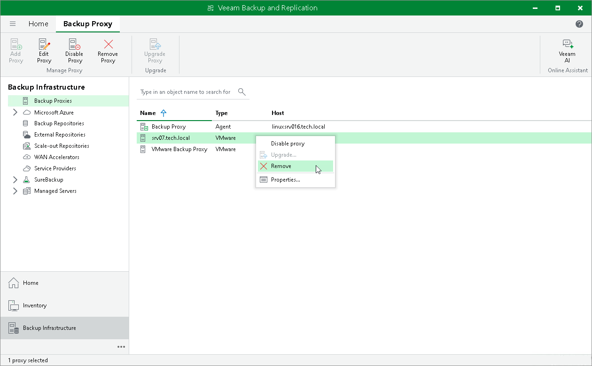

# Disabling and Removing VMware Backup Proxies

In this article

You can temporarily disable a VMware backup proxy or remove it from the backup infrastructure.

Disabling Backup Proxies

When you disable a VMware backup proxy, Veeam Backup & Replication does not use this backup proxy for any jobs configured on the backup server. VMware backup proxy disabling can be helpful if you instruct Veeam Backup & Replication to automatically select backup proxies for jobs and do not want Veeam Backup & Replication to use specific backup proxies.

You can disable all VMware backup proxies, including the default backup proxy installed on the backup server. Do not disable all VMware backup proxies at once. Otherwise, Veeam Backup & Replication will not be able to perform backup, replication and restore operations that use VMware backup proxies.

To disable a VMware backup proxy:

1. Open the Backup Infrastructure view.
2. In the [inventory pane](vbr_ui.md), select the Backup Proxies node.
3. In the working area, select the VMware backup proxy and click Disable Proxy on the ribbon or right-click the backup proxy and select Disable proxy.

You can enable a disabled VMware backup proxy at any time:

1. Open the Backup Infrastructure view.
2. In the inventory pane, select the Backup Proxies node.
3. In the working area, select the VMware backup proxy and click Disable Proxy on the ribbon once again or right-click the VMware backup proxy and select Disable proxy.

Removing VMware Backup Proxies

You can permanently remove a VMware backup proxy from the backup infrastructure. When you remove a VMware backup proxy, Veeam Backup & Replication unassigns the VMware backup proxy role from the server, and this server is no longer used as a VMware backup proxy. The actual server remains in the backup infrastructure.

You can remove all VMware backup proxies, including the default backup proxy installed on the backup server. Do not remove all VMware backup proxies at once. Otherwise, Veeam Backup & Replication will not be able to perform backup, replication and restore operations that use VMware backup proxies.

You cannot remove a VMware backup proxy that is explicitly selected in any backup, replication or VM copy job. To remove such VMware backup proxy, you first need to delete a reference to this VMware backup proxy in the job settings.

To remove a VMware backup proxy:

1. Open the Backup Infrastructure view.
2. In the inventory pane, select the Backup Proxies node.
3. In the working area, select the VMware backup proxy and click Remove Proxy on the ribbon or right-click the VMware backup proxy and select Remove.

Page updated 12/21/2023

Page content applies to build 13.0.1.1071
