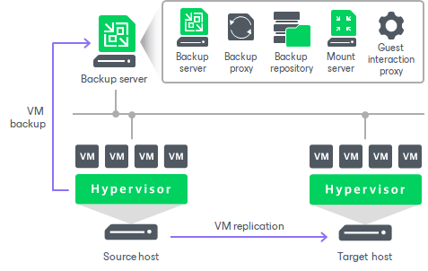

# Simple Deployment

The simple deployment scenario is good for small virtual environments or for the purpose of the Veeam Backup & Replication evaluation. In this scenario, Veeam Backup & Replication and all services needed for data protection tasks are installed on a single Windows-based machine.

|  |
| --- |
| Important |
| [For Microsoft Hyper-V] We do not recommend you to install Veeam Backup & Replication directly on a Hyper-V host. Such installation may lead to unpredictable system behavior. Instead, install Veeam Backup & Replication and its components on dedicated machines. Backup infrastructure component roles can be co-installed. |

|  |
| --- |
| Note |
| If you decide to use the simple deployment scenario, it is recommended that you install Veeam Backup & Replication on a VM. This will enable you to use the Virtual appliance transport mode and, as a result, LAN-free data transfer. For details, see [Transport Modes](transport_modes.md). |

The machine where Veeam Backup & Replication is installed performs the following roles:

* Backup server that coordinates all jobs, controls their scheduling and performs other administrative activities.
* Default backup repository where backup files are stored. During installation, Veeam Backup & Replication checks volumes of the machine on which you install the product and identifies a volume with the greatest amount of free disk space. On this volume, Veeam Backup & Replication creates the Backup folder that is used as the default backup repository.
* Mount server that is needed for restoring of VM guest OS files.
* Guest interaction proxy that is needed for application-aware processing, guest file system indexing and transaction log processing.
* [For VMware vSphere] Default VMware backup proxy that handles job processing and transfers backup traffic.

On Microsoft Hyper-V, the role of the default backup proxy is assigned to the source Hyper-V server. It handles job processing and transfers backup traffic directly to the target server. All services necessary for the backup proxy are installed directly on the source Hyper-V server.

Veeam Backup & Replication is ready for use right after the installation. The only thing you must do is add virtualization servers that you plan to use as source and target for backup, replication and other activities. For details, see [Virtualization Servers and Hosts](setup_add_server.md).

The drawback of a simple deployment scenario in vSphere environments is that all data is handled and stored on the backup server. For medium-sized or large-scale environments, the capacity of a single backup server may not be enough.

In Hyper-V environments that require a large number of backup or replication activities to be performed, the simple deployment scheme is not appropriate due to the following reasons:

* The backup server may not have enough disk capacity to store the required amount of backup data.
* A significant load is placed on production servers that combine the roles of backup proxies and source hosts.

To take the overhead off the backup server, source Hyper-V servers and balance it throughout your backup infrastructure, we recommend that you use the advanced deployment scenario. For details, see [Advanced Deployment](advanced.md).

Related Topics

[Backup Infrastructure Components](components.md)

[Advanced Deployment](advanced.md)

[Distributed Deployment](distributed.md)

