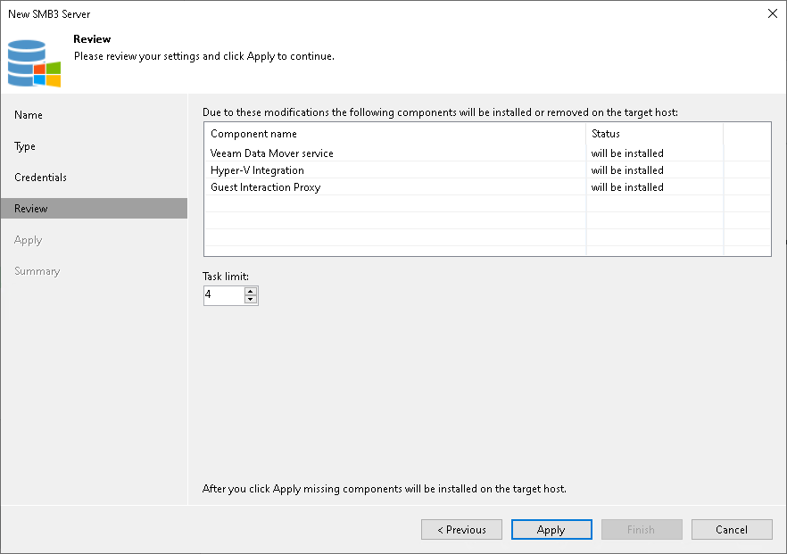

# Step 5. Review Components

At the Apply step of the wizard, review what Veeam Backup & Replication components are already installed on the server and what components will be installed.

1. Review the components.
2. Click Apply to add the Microsoft SMB3 server or cluster to the backup infrastructure.

