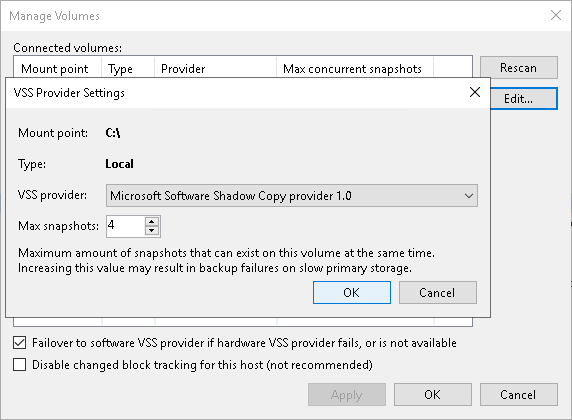

# Step 7. Configure SMB3 Shares

In this article

After you have added a Microsoft SMB3 server, you can configure the following settings for shared folders hosted on this server:

* [Enable or disable changed block tracking](smb_configure.md#cbt)
* [Define the number of concurrent snapshots for a shared folder](smb_configure.md#volume)

Before you specify settings for a Microsoft SMB3 server, you must rescan shared folders on this server. During shared folders rescan, Veeam Backup & Replication retrieves information about shared folders that are currently hosted on a Microsoft SMB3 server, updates the list of shared folders and writes this information to the configuration database.

Veeam Backup & Replication automatically rescans the list of shared folders every 4 hours. You can also start shared folders rescan manually:

1. Open the Backup Infrastructure view.
2. In the [inventory pane](vbr_ui.md), select Managed servers.
3. In the working area, select the Microsoft SMB3 server and click Rescan on the ribbon. Alternatively, you can right-click the Microsoft SMB3 server and select Rescan.

Changed Block Tracking Settings

By default, Veeam Backup & Replication uses changed block tracking for processing all VMs that reside on shared folders hosted by a Microsoft SMB3 server. You can disable changed block tracking, for example, for testing purposes.

Change block tracking is enabled and disabled at the level of the Microsoft Hyper-V host.

|  |
| --- |
| Important |
| The Disable changed block tracking for this host setting does not apply to VMs that are registered on Microsoft Hyper-V Server 2016 and later. |

To disable changed block tracking:

1. Open the Backup Infrastructure view.
2. In the [inventory pane](vbr_ui.md), select Managed servers.
3. In the working area, select the Microsoft SMB3 server and click Shared Folders on the ribbon. Alternatively, you can right-click the Microsoft SMB3 server and select Shared Folders.
4. In the Manage Volumes window, select the Disable changed block tracking for this host check box.

Shared Folder Settings

You can specify the maximum number of concurrent Hyper-V snapshots that must exist for a shared folder hosted by a Microsoft SMB3 server.

To specify shared folder settings:

1. Open the Backup Infrastructure view.
2. In the [inventory pane](vbr_ui.md), select Managed servers.
3. Select the necessary Microsoft SMB3 server in the working area and click Manage Volumes on the ribbon. Alternatively, you can right-click the necessary Microsoft SMB3 server in the working area and select Manage Volumes.
4. Select the necessary shared folder in the list and click Edit.

1. By default, jobs working with the same shared folder can take up to 4 snapshots of a folder simultaneously. If necessary, you can increase or decrease the number of snapshots that can exist at the same time. It is not recommended to increase the number of snapshots for slow storage: a great number of snapshots existing at the same time may cause VM processing failures.

|  |
| --- |
| Note |
| For VMs hosted on Microsoft Hyper-V Server 2016 and later, the Snapshots value defines the maximum number of checkpoints that may be retained for a processed VM. The setting is specified at the level of a shared folder in which VM disks reside. |

Page updated 12/21/2023

Page content applies to build 13.0.1.1071
