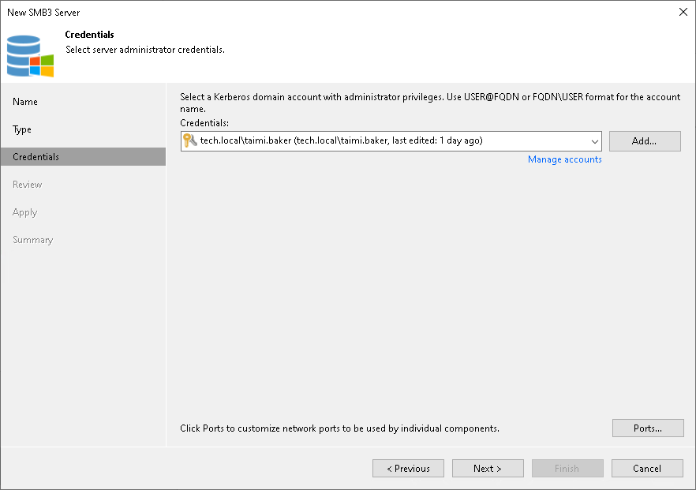
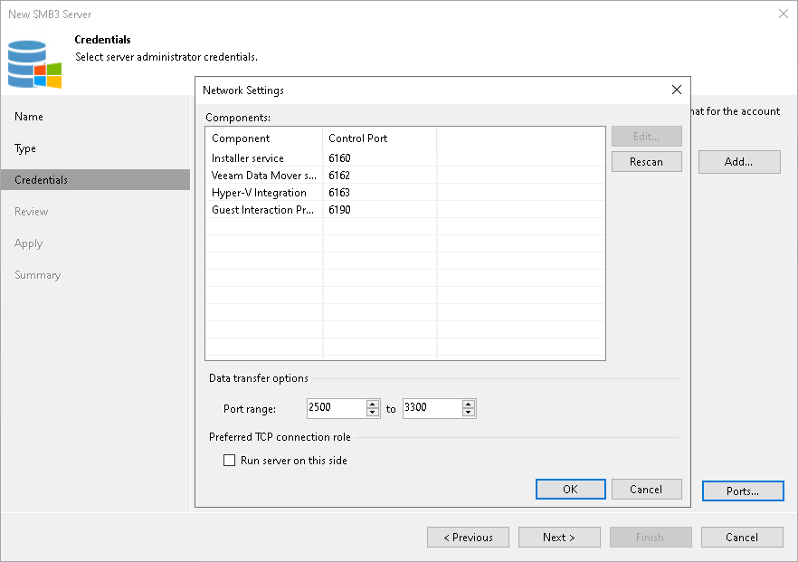

# Step 4. Specify Credentials

In this article

At the Credentials step of the wizard, specify credentials for the Microsoft SMB3 server or cluster.

1. From the Credentials list, select credentials for the account that has administrator privileges on the Microsoft SMB3 server or cluster. If you have not set up credentials beforehand, click the Manage accounts link or click Add on the right to add the credentials. For more information, see [Managing Credentials](credentials_manager.md).

+ For domain user accounts, the user name must be specified in the DOMAIN\USERNAME format.
+ For local user accounts, the user name must be specified in the HOSTNAME\USERNAME format.

Veeam Backup & Replication will use the provided credentials to deploy the following components on the Microsoft SMB3 server or cluster nodes:

+ Veeam Installer Service
+ Veeam Data Mover Service/Veeam Transport Service
+ Veeam Hyper-V Integration Service

1. To customize network ports used by Veeam Backup & Replication components, click Ports. By default, Veeam Backup & Replication components use the following ports:

+ Veeam Installer Service: port 6160
+ Veeam Data Mover Service/Veeam Transport Service: port 6162
+ Veeam Hyper-V Integration Service: port 6163

If necessary, adjust port numbers.

1. In the Data transfer options section of the Network Settings window, specify connection settings for file copy operations. Provide a range of ports that will be used as transmission channels between the source server and target server (one port per task). By default, Veeam Backup & Replication uses port range 2500-3300. If the virtual environment is not large and data traffic will not be significant, you can specify a smaller range of ports, for example, 2500-2509 to run 10 concurrent jobs at the same time.

1. [For Microsoft SMB3 server or cluster deployed outside NAT] In the Preferred TCP connection role section select the Run server on this side check box. In the NAT scenario, the outside client cannot initiate a connection to the server on the NAT network. As a result, services that require initiation of the connection from outside can be disrupted. With this option selected, you will be able to overcome this limitation and initiate a ‘server-client’ connection — that is, a connection in the direction of the Microsoft SMB3 server or cluster.

The option applies if the server or cluster also performs the role of the onhost backup proxy.

Page updated 8/26/2025

Page content applies to build 13.0.1.1071
