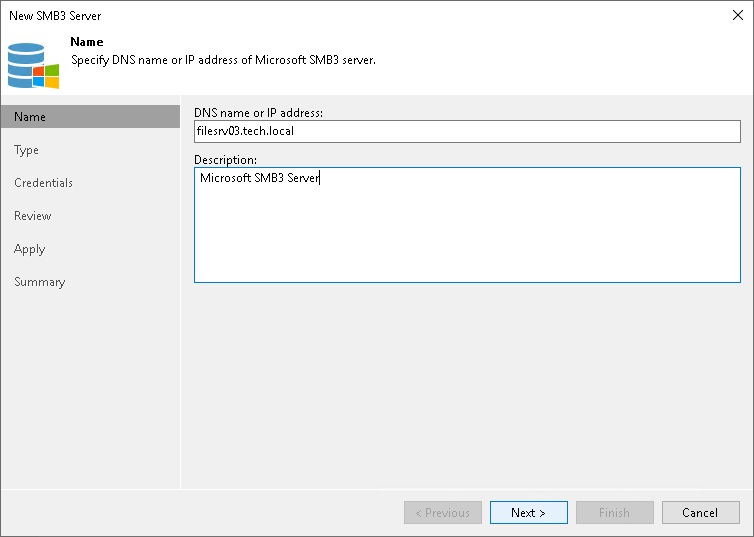

# Step 2. Specify Server Name or Address

In this article

At the Name step of the wizard, specify an address and description for the Microsoft SMB3 server or cluster.

1. Enter a full DNS name or IP address of the Microsoft SMB3 server or cluster.
2. Provide a description for future reference. The default description contains information about the user who added the server, date and time when the server was added.

Page updated 11/22/2023

Page content applies to build 13.0.1.1071
