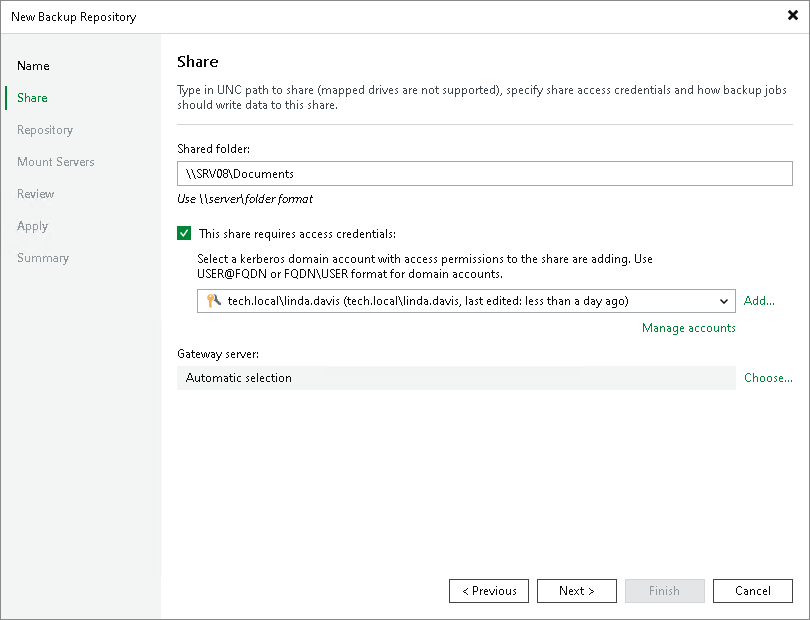

# Step 3. Specify Shared Folder Settings

In this article

To configure settings for an SMB share:

1. In the Shared folder field, specify a UNC path to the SMB shared folder that you want to use as a backup repository. If you use the IPv6 address, specify the path in a literal format, for example, \\[1080--8-800-200c-417a.ipv6-literal.net]\folder. For more information, see [RFC 2732](https://www.rfc-editor.org/rfc/rfc2732). Note that you can use IPv6 addresses only if IPv6 communication is enabled as described in section [IPv6 Support](ipv6.md).
2. If you must specify user credentials to access the shared folder, select the This share requires access credentials check box. From the Credentials list, select a credentials record for a user account that has permissions described in section [Permissions](required_permissions.md). Note that the authentication process uses the standard Microsoft Kerberos protocol.

If you have not set up credentials beforehand, click the Manage accounts link at the bottom of the list or click Add on the right to add the credentials. For more information, see [Credentials Manager](credentials_manager.md).

1. In the Gateway server field, specify settings for the gateway server:

* If you want Veeam Backup & Replication to select a gateway server automatically, leave Automatic selection.
* If you want to select servers that can be used as gateway servers explicitly, click Choose next to the Gateway server field. In the Gateway Server window, click Use the following gateway servers only and select servers. The servers must have a direct access to the SMB share and must be located as close to the SMB share as possible. Veeam Backup & Replication will choose the most suitable server.

For more information on the gateway servers, their requirements and limitations, and how they are selected, see [Gateway Servers](gateway_server.md#requirements).

Page updated 1/15/2026

Page content applies to build 13.0.1.1071
