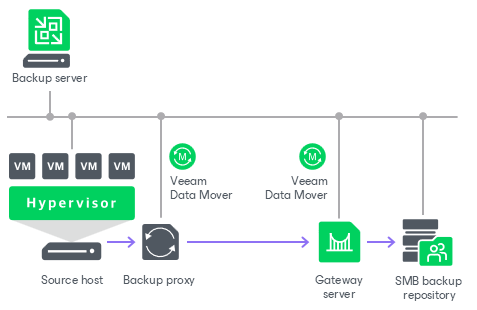

# SMB (CIFS) Share

You can use SMB (CIFS) shares as backup repositories.

SMB Backup Repository Deployment

To communicate with an SMB backup repository, Veeam Backup & Replication uses two [Veeam Data Movers](veeam_transport_service.md) that are responsible for data processing and transfer:

* Veeam Data Mover on the VMware or off-host backup proxy
* Veeam Data Mover on the gateway server

An SMB share cannot host Veeam Data Movers. For this reason, to communicate with the SMB share, you need to deploy a gateway server. Veeam Backup & Replication will automatically deploy a Veeam Data Mover on this gateway server. For more information on gateway server requirements and limitations, see [Gateway Servers](gateway_server.md#requirements).

When any job addresses the SMB backup repository, Veeam Data Mover on the gateway server establishes a connection with Veeam Data Mover on the VMware or off-host backup proxy, enabling efficient data transfer over LAN or WAN.

If you plan to move VM data to an off-site SMB repository over a WAN link, it is recommended that you deploy an additional gateway server in the remote site, closer to the SMB repository.

Requirements for SMB Backup Repositories

The role of an SMB repository can be assigned to a Microsoft Windows machine (physical or virtual). The machine must meet the system requirements. For more information, see [System Requirements](system_requirements.md#target).

Related Topics

* [Adding SMB (CIFS) Repositories](smb_repository_add.md)
* [Gateway Servers](gateway_server.md)

