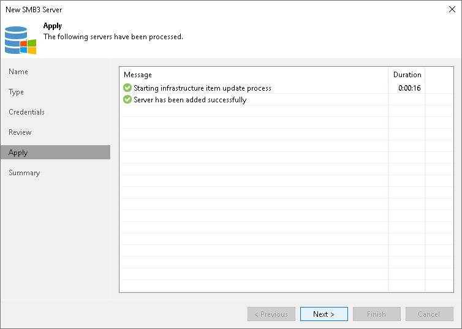

# Step 6. Finish Working with Wizard

At the Result step of the wizard, complete the procedure of Microsoft SMB3 server or cluster adding.

1. Review details of the Microsoft SMB3 server or cluster.
2. Click Next, then click Finish to exit the wizard.

