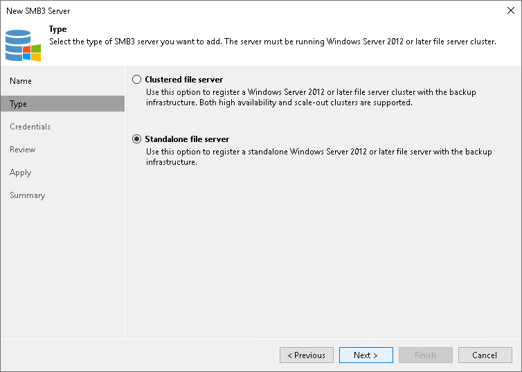

# Step 3. Specify Server Type

In this article

At the Type step of the wizard, select what type of Microsoft SMB3 server you want to add.

* Select Clustered file server if you want to add a Microsoft SMB3 cluster to the backup infrastructure. Veeam Backup & Replication supports high availability and scale-out Microsoft SMB3 clusters.
* Select Standalone file server if you want to add a standalone Microsoft SMB3 server to the backup infrastructure.

Page updated 1/25/2024

Page content applies to build 13.0.1.1071
