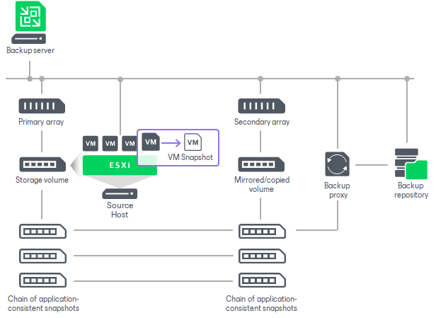

# Backup from Storage Snapshots with Snapshot Retention

You can configure a backup job to create regular backup files in the backup repository and, additionally, maintain a snapshot chain on the storage system. Veeam Backup & Replication lets you create long-term storage snapshots in the following destinations:

* Primary storage array where VM disks are hosted
* Secondary storage arrays

Depending on the backup job settings, the created storage snapshots can be application-consistent or crash-consistent.

How Backup from Storage Snapshots with Snapshot Retention Works

The backup job of this type is performed in the following way:

1. Veeam Backup & Replication triggers the vCenter Server to create a VMware snapshot for a VM.
2. Veeam Backup & Replication instructs the storage system to create two snapshots of a volume or LUN capturing VM disks:

+ A long-term snapshot on the storage system. This snapshot remains in the snapshot chain until it is removed by the retention policy.
+ A temporary snapshot for backup or replication operations. This snapshot is removed after backup or replication is complete.

1. Veeam Backup & Replication removes the created VMware snapshot from the VM snapshot list.
2. Veeam Backup & Replication uses the temporary storage snapshot as a data source for backup and replication.
3. Veeam Backup & Replication performs cleanup operations and removes the temporary snapshot on the storage array.
4. Veeam Backup & Replication checks the number of long-term storage snapshots in the snapshot chain. If the number exceeds the value defined in retention policy settings, Veeam Backup & Replication instructs the storage system to remove the earliest snapshot from the snapshot chain.

Related Topics

* [Configuring Backup Jobs with Storage Snapshot Retention](snapshot_job_secondary_perform.md)
* [General Limitations](storage_limitations_general.md)

