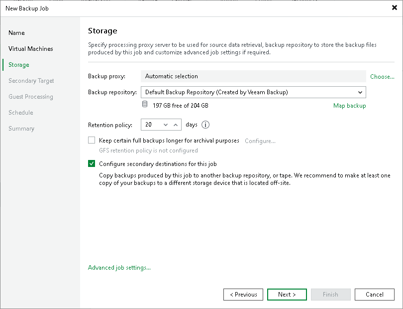
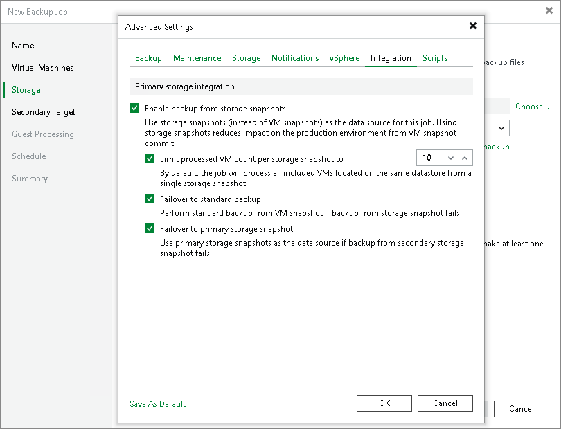
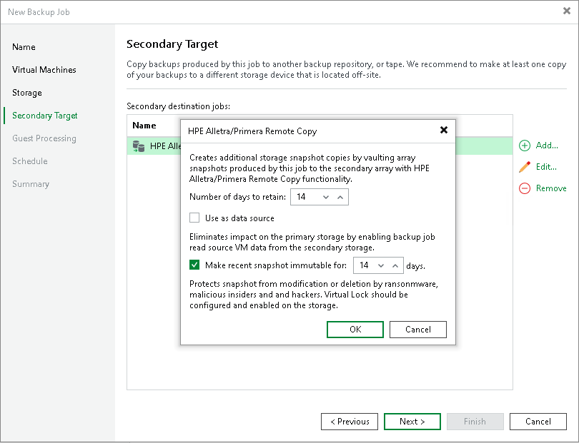

# Configuring Backup Jobs with Storage Snapshot Retention

You can configure a backup job to create backup files and a chain of long-term storage snapshots on the primary storage array, on the secondary storage arrays or both.

Key Job Settings

The key job settings responsible for backup from storage snapshots with snapshot retention are:

* At the Storage step of the wizard, the Configure secondary destinations for this job.

* At the Storage step of the wizard, in the Advanced settings, the Enable backup from storage snapshots check box.

* At the Secondary Target step of the wizard, the added option to create snapshots on the primary storage array or a feature of a secondary storage array, or both, the Use as data source check box, and the Number of days to retain field.

Configuring Backup Job with Storage Snapshot Retention

To configure a backup job:

1. Open the Home view.
2. Click Backup Job > VMware or Cloud Director on the ribbon. Veeam Backup & Replication will launch the New Backup Job wizard.
3. At the Name step of the wizard, specify a name and description for the backup job.
4. At the Virtual Machines step of the wizard, select VMs whose disks are hosted on a storage system.
5. At the Storage step of the backup job wizard, do the following:

1. Select a backup proxy that will be used for data transfer. You can assign the backup proxy explicitly or choose the automatic mode of backup proxy selection.

|  |
| --- |
| Note |
| A backup proxy that you select must be added to the list of backup proxies in storage system connection settings. If the backup proxy is not added to the list in storage system connection settings, Veeam Backup & Replication may fail over to the regular data processing mode. To switch on the failover, at the Storage step of the backup or replication job wizard, click Advanced and select the Failover to standard backup check box.  For more information, see [Adding Storage Systems](storage_configure_add_storage.md). |

1. From the Backup repository list, select a backup repository where you want to store backup files.
2. In the Retention policy section, specify the number of days for which you want to maintain backup restore points.
3. Select the Configure secondary destinations for this job check box.

1. Click Advanced, then click the Integration tab. Make sure that the Enable backup from storage snapshots check box is selected. By default, this option is enabled for all newly created jobs.
2. If you add to the job many VMs whose disks are located on the same volume or LUN, select the Limit processed VM count per storage snapshot to <N> check box and specify the number of VMs for which one temporary storage snapshot must be created. Veeam Backup & Replication will divide VMs into several groups and trigger a separate temporary storage snapshot for every VM group. As a result, the job performance will increase. For more information, see [Limitation on Number of VMs per Snapshot](storage_limiting.md).
3. If Veeam Backup & Replication fails to create a temporary storage snapshot, VMs whose disks are located on the storage system will not be processed by the job. To fail over to the regular data processing mode and back up such VMs, select the Failover to standard backup check box.
4. If Veeam Backup & Replication cannot create a temporary storage snapshot on the secondary storage array, the job will not back up VMs whose disks are located to the storage system. To fail over to backup from storage snapshots on the primary storage system, select the Failover to primary storage snapshot check box. For more information, see [Failover to Backup from Snapshots on Primary Storage Arrays](storage_secondary_backup.md#failover).

1. At the Secondary Target step of the wizard, click Add and select where to create long-term snapshots, that is, snapshots for a snapshot chain. You can select an option to create snapshots on the primary storage array or create snapshots on the secondary storage array using a replication or archiving feature, or both — on the primary and secondary arrays. Also, configure the number of days for which you want to retain snapshots in the snapshot chain and configure which feature to use as the data source for backup operations, if required. Additionally, you can prohibit snapshot deletion and modificaion, that is, configure immutability.

If you want to create a snapshot chain on the secondary storage array with synchronous replication, you must add an option to create snapshots on the primary storage array and specify the Number of days to retain. Long-term snapshots will be created simultaneously on the primary and secondary storage arrays, that is, coordinated snapshots will be created. Veeam Backup & Replication will retain the same number or snapshots on both storage arrays. If you want to prohibit snapshot deletion and modificaion for some period of time, configure the Make recent backups immutable for field. Veeam Backup & Replication will protect snapshots against deletion on both storage arrays. If you also want to use the secondary storage array as a source for backup, add the synchronous replication feature to the list of the used features. Check that the Use as the data source check box is enabled.

If you want to create a snapshot chain on the primary storage system or secondary storage system with snapshot transfer or archiving feature, do the following:

1. Add an option to create snapshots on the primary storage array, snapshot transfer or archiving feature.
2. In the Number of days to retain field, specify the number of days for which you want to retain long-term storage snapshots on the storage array, that is, snapshots in the snapshot chain. When this number is exceeded, Veeam Backup & Replication will trigger the storage system to remove the earliest outdated snapshots from the chain.
3. [For snapshot transfer] To use the secondary storage array as a source for backups, select the Use as data source check box.
4. [For primary storage or snapshot transfer] To prohibit deletion and modification of long-term storage snapshots, select the Make recent snapshots immutable for check box. Then specify the immutability period — the duration that snapshots must remain unchanged. If the specified immutability period exceeds the storage system maximum immutability period, it will default to the maximum allowed value.

For more information on the storage systems, supported features and required licenses, see [Supported Storage Features for Backup and Orchestration](supported_features.md#feature).

1. Specify other backup job settings as required.
2. Click Next, then click Finish to save the job settings.

|  |
| --- |
| Tip |
| To learn which VMs were processed by a snapshot job (a snapshot-only job or a backup job with storage snapshot retention) open the Storage Infrastructure view and navigate to the necessary storage snapshot. If a VM was processed by a snapshot job, Veeam Backup & Replication displays the job name in the Protected by column. |

Related Topics

[Backup from Storage Snapshots with Snapshot Retention](snapshot_job_secondary.md)

