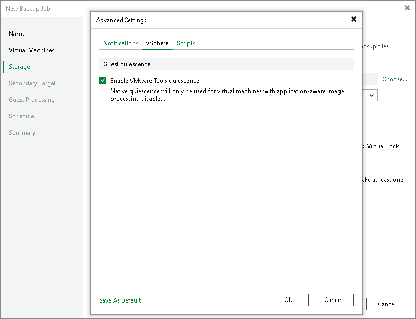
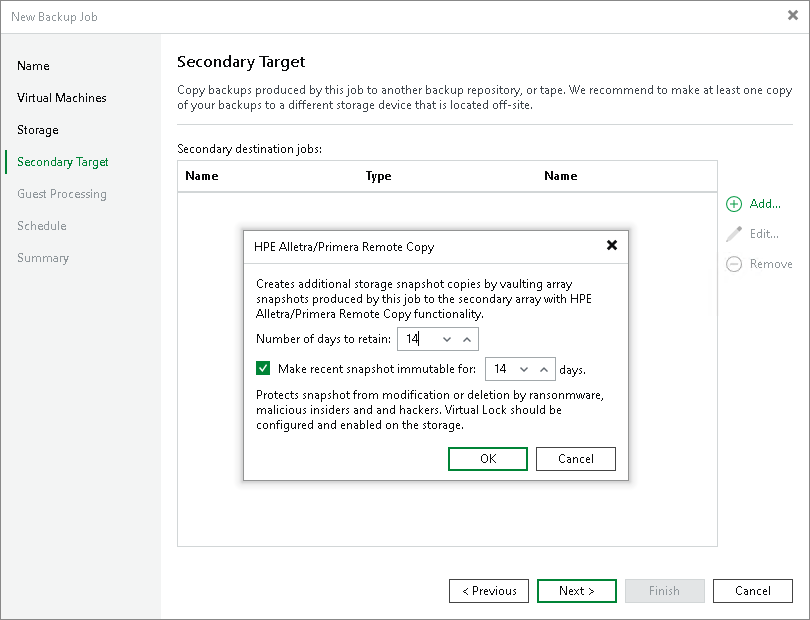
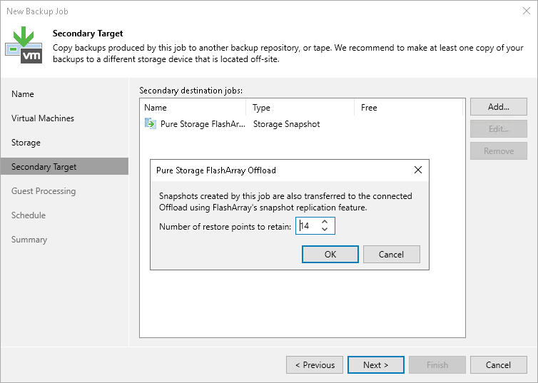
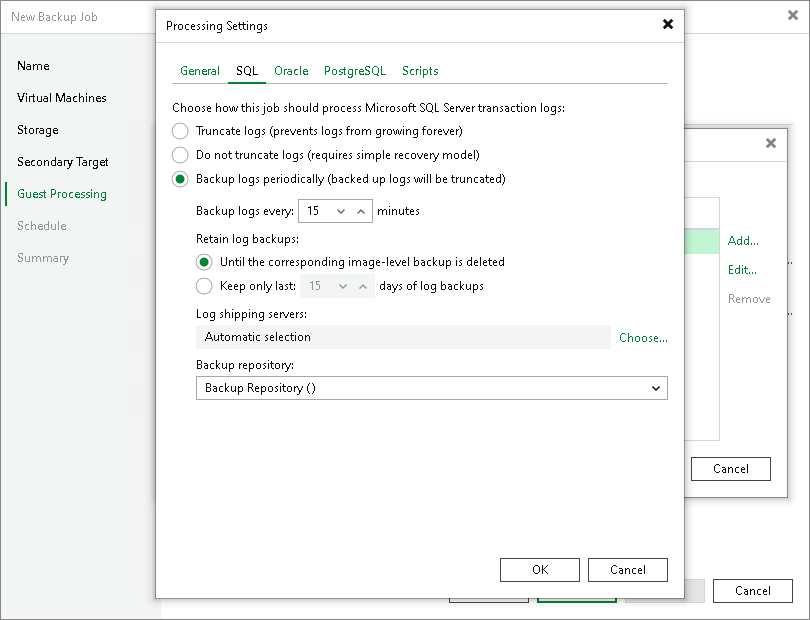

# Configuring Snapshot-Only Jobs

You can use snapshot-only jobs to create a chain of storage snapshots on the primary storage array and, optionally, on the secondary storage array.

Key Job Settings

The key settings for the snapshot-only job are:

* At the Storage step of the wizard, a primary storage system selected as a repository.
* At the Storage step of the wizard, the Retention policy field.
* [Optional] At the Storage step of the wizard, the Configure secondary destinations for this job.

* [Optional] At the Secondary Target step of the wizard, the added feature of a storage array, the Number of days to retain field.

Configuring Snapshot-Only Jobs

To configure a snapshot-only job:

1. Open the Home view.
2. Click Backup Job > VMware or vCloud on the ribbon. Veeam Backup & Replication will launch the New Backup Job wizard.
3. At the Name step of the wizard, specify a name and description for the job.
4. At the Virtual Machines step of the wizard, click Add and select VMs whose disks are hosted on the storage system.
5. At the Storage step of the wizard, select a primary storage array, configure retention and immutability:

1. From the Backup repository drop-down list, select a primary storage array where you want to create a chain of long-term storage snapshots.
2. In the Retention policy field, specify the number of days for which you want to maintain long-term storage snapshots in the snapshot chain on the primary storage array. When this number is exceeded, Veeam Backup & Replication will trigger the storage system to remove the earliest outdated snapshots from the chain (if it does not contain any restore points that fall under the retention period).
3. To prohibit deletion and modification of long-term storage snapshots, select the Make recent snapshots immutable for check box. Then specify the immutability period — the duration that snapshot can not be edited, deleted or rewritten once it is created.

If the specified immutability period exceeds the storage system maximum immutability period, it will default to the maximum allowed value.

For more information on the storage systems, supported features and required licenses, see [Supported Storage Features for Backup and Orchestration](supported_features.md#feature).

1. To create application-consistent long-term storage snapshots for VMs for which application-aware processing is disabled, enable VMware Tools quiescence. Otherwise, Veeam Backup & Replication will produce crash-consistent long-term storage snapshots.

1. At the Storage step of the wizard, click Advanced.
2. In the Advanced Settings window, go to the vSphere tab and select Enable VMware Tools quiescence.

Veeam Backup & Replication will create VMware snapshots for VMs whose disks are hosted on the storage system. After VMware snapshots are created, Veeam Backup & Replication will trigger a storage snapshot.

For information on other advanced settings, see the [Specify Advanced Backup Settings](backup_job_advanced_vm.md) section in the Veeam Backup & Replication User Guide.

1. If you want to create long-term storage snapshots on a secondary storage array:

1. At the Storage step of the wizard, select the Configure secondary destinations for this job check box.
2. At the Secondary Target step of the wizard, configure a replication feature. The following types of [replication features](supported_features.md) are available:

* Synchronous replication

You cannot select the synchronous replication feature explicitly. Veeam Backup & Replication uses secondary storage arrays with synchronous replication by default if detects the configured ones. In this case, the snapshot retention and immutability for both primary and secondary storage arrays is configured at the step 5 of this procedure.

|  |
| --- |
| Note |
| If you use the [appropriate license edition](supported_features.md#feature) and secondary storage arrays with synchronous replication (for example, IBM FlashSystem with Metro Mirror or other), Veeam Backup & Replication uses the synchronous replication feature by default. On such storage array systems, long-term snapshots are always created simultaneously on the primary and secondary storage arrays, that is, coordinated snapshots are created. Veeam Backup & Replication maintains the same number of long-term snapshots on the primary and secondary arrays. For snapshot-only jobs, this means that you do not need to add the synchronous replication feature to the job and configure it. |

* Snapshot transfer

To add the snapshot transfer feature, click Add and select the required feature. In the Number of days to retain field, specify the number of days for which you want to maintain long-term storage snapshots in the snapshot chain on the secondary storage array. When this number is exceeded, Veeam Backup & Replication will trigger the storage system to remove the earliest outdated snapshots from the chain. To prohibit deletion and modification of long-term storage snapshots for some period of time, select the Make recent snapshots immutable for check box and specify the immutability period, that is, how long snapshots must stay unchanged. If the specified immutability period exceeds the storage system maximum immutability period, it will default to the maximum allowed value.

For more information on the storage systems, supported features and required licenses, see [Supported Storage Features for Backup and Orchestration](supported_features.md#feature).

1. If you want to use snapshot archiving, that is, offload snapshots to a 3rd party storage solution supported by a storage vendor (for example, Amazon S3 storage or NFS target):

1. Check that the Configure secondary destinations for this job check box is selected at the Storage step of the wizard.
2. At the Secondary Target step of the wizard, select an archiving feature.
3. In the Number of days to retain field, specify the number of days for which you want to maintain long-term storage snapshots in the offload target.

For more information on the storage systems, supported features and required licenses, see [Supported Storage Features for Backup and Orchestration](supported_features.md#feature).

1. If you want to create transactionally consistent snapshots, enable application-aware processing:

1. At the Guest Processing step of the wizard, select the Enable application-aware processing check box.
2. Specify the necessary settings as described in the [Specify Guest Processing Settings](backup_job_vss_vm.md) section in the Veeam Backup & Replication User Guide.
3. Configure general application-awarere processing settings and settings for applications as described in the [dedicated sections](backup_job_vss_application_vm.md) in the Veeam Backup & Replication User Guide.

If you plan to back up logs, in addition to the options described in the Veeam Backup & Replication User Guide, set a repository for storing logs. To do so, in the Processing Settings window, select a tab with the application for which you are configuring logs. In the Backup repository field, select a backup repository. Note that you specify the backup repository for the whole job, not just for a VM you have selected.

The process of application-aware processing is similar to the one described in the [Application-Aware Processing](application_aware_processing.md) section in the Veeam Backup & Replication User Guide. The difference is that Veeam Backup & Replication does not create VMware snapshots for freeze-only VMs and triggers storage snapshots after the stage with VMware snapshots. A VM is freeze-only if it meets these conditions:

* The disks of this VM can be located on one or more storage volumes.
* These storage volumes only contain the disks of this VM. They do not contain the disks of any other VM that are included in the same job.

The freeze-only VMs (those VMs for which a VMware snapshot was not created) are processed in successive order after creating storage snapshots for the other VMs.

1. At the Schedule step of the wizard, select the Run the job automatically check box and specify the schedule by which storage snapshots must be created. For more information, see the [Define Job Schedule](backup_job_schedule_vm.md) section in the Veeam Backup & Replication User Guide.
2. At the Summary step of the wizard, review settings of the added storage system. Select the Run the job when I click Finish check box if you want to start the job right after you finish working with the wizard. Click Finish to save the backup job settings.

|  |
| --- |
| Tip |
| To learn which VMs were processed by a snapshot job (a snapshot-only job or a backup job with storage snapshot retention) open the Storage Infrastructure view and navigate to the necessary storage snapshot. If a VM was processed by a snapshot job, Veeam Backup & Replication displays the job name in the Protected by column. |

