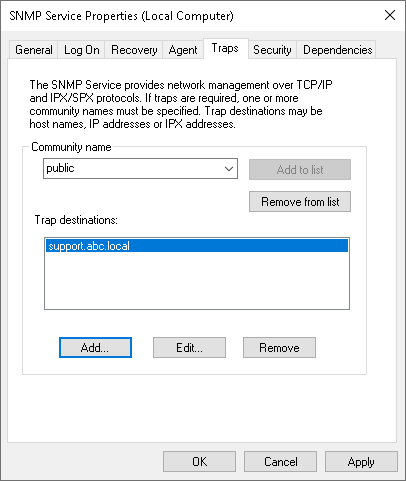
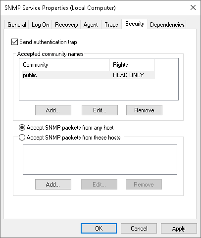

# Configuring SNMP Service Properties

In this article

To configure SNMP service properties on recipient systems:

1. Install a standard Microsoft SNMP agent from the Microsoft Windows distribution on the computer.
2. From the Start menu, select Control Panel > Administrative Tools > Services.
3. Double-click SNMP Service to open the SNMP Service Properties window.
4. Click the Traps tab.
5. Add the public string to the Community name list and name of the necessary host to the Trap destinations list.

1. Click the Security tab.
2. Make sure the Send authentication trap check box is selected.
3. Add the public string to the Accepted community names list.
4. Select the Accept SNMP packets from any host check box.
5. Click OK to save changes.

Page updated 1/25/2024

Page content applies to build 13.0.1.1071
