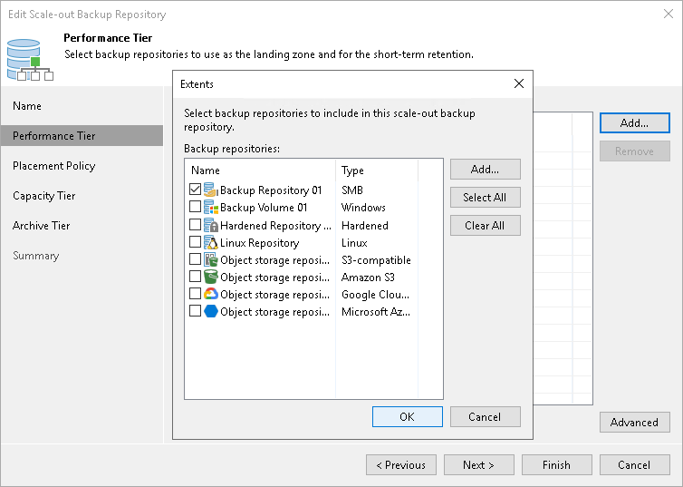
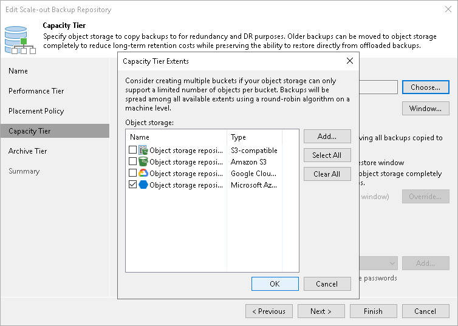

# Extending Scale-Out Repositories

In this article

You can add a backup repository or an object storage repository as a performance extent or a capacity extent to the scale-out backup repository at any time. For example, the scale-out backup repository may run low on space, and you will need to add storage capacity to it.

Extending Performance Tier

To extend the performance tier, perform the following steps:

1. Check the [limitations for performance tier](performance_tier_limitations.md).
2. Open the Backup Infrastructure view.
3. In the [inventory pane](vbr_ui.md), click Scale-out Repositories.
4. In the working area, select the scale-out repository and click Edit Scale-out Repository on the ribbon or right-click the backup repository and select Properties.
5. Move to the Performance tier step of the wizard.
6. Click Add.
7. In the Extents window, select a check box next to the backup repository that you want to add as a performance extent to the scale-out backup repository.

If a backup repository that you add as a performance extent is already used by jobs of supported type or there are backups pointing at the backup repository (for example, independent backups created by VeeamZIP), Veeam Backup & Replication will offer you to update a link to the backup repository in the job properties. Click Yes to update the link and target the jobs and backups at the scale-out backup repository. If you click No, you will not be able to pass to the next steps of the wizard.

1. Pass through the next wizard steps and finish working with the wizard. The new performance extent will be added to the scale-out backup repository.

|  |
| --- |
| Note |
| After you add a backup repository to the scale-out backup repository as a performance extent, you will not be able to use it as an individual backup repository. |

Extending Capacity Tier

To extend the capacity tier, perform the following steps:

1. Check the [limitations for capacity tier](capacity_tier_limitations.md).
2. Open the Backup Infrastructure view.
3. In the [inventory pane](vbr_ui.md), click Scale-out Repositories.
4. In the working area, select the scale-out repository and click Edit Scale-out Repository on the ribbon or right-click the backup repository and select Properties.
5. Move to the Capacity tier step of the wizard.
6. Click Choose.
7. In the Capacity Tier Extents window, select a check box next to the backup repository that you want to add as a capacity extent to the scale-out backup repository.
8. If a backup repository that you add as a capacity extent is already used by jobs of supported type or there are backups pointing at the backup repository (for example, independent backups created by VeeamZIP), Veeam Backup & Replication will offer you to update a link to the backup repository in the job properties. Click Yes to update the link and target the jobs and backups at the scale-out backup repository. If you click No, you will not be able to pass to the next steps of the wizard.
9. Pass through the next wizard steps and finish working with the wizard. The new capacity extent will be added to the scale-out backup repository.

Page updated 4/29/2025

Page content applies to build 13.0.1.1071
