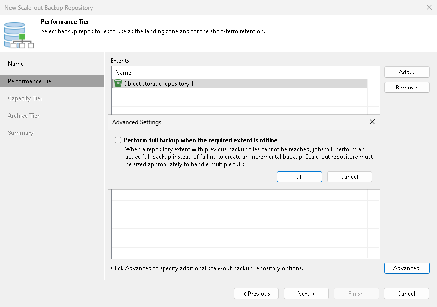

# Step 3. Add Performance Extents

At the Performance Tier step of the wizard, specify which backup repositories or object storage repositories you want to add as performance extents, and configure options for the scale-out backup repository.

1. On the right of the Extents list, click Add.
2. In the Extents window, select check boxes next to backup repositories or object storage repositories that you want to add as performance extents.
3. Click OK.
4. At the lower right corner of the Extents list, click Advanced.
5. To preserve the consistency of backup chains in the scale-out backup repository, select the Perform full backup when required extent is offline check box. If an extent that contains previous restore points from the current backup chain gets offline, the backup chain will be broken. Veeam Backup & Replication will not be able to add a new incremental backup file. With this option enabled, Veeam Backup & Replication will create a full backup file instead of an incremental backup file. If you enable this option, you must make sure that you have enough free space in the scale-out backup repository to host a full backup file.

If a backup repository that you add as a performance extent is already used by jobs of supported type or there are backups pointing at the backup repository (for example, independent backups created by VeeamZIP), Veeam Backup & Replication will offer you to update a link to the backup repository in the job properties. Click Yes to update the link and target the jobs and backups at the scale-out backup repository. If you click No, you will not be able to pass to the next steps of the wizard.

