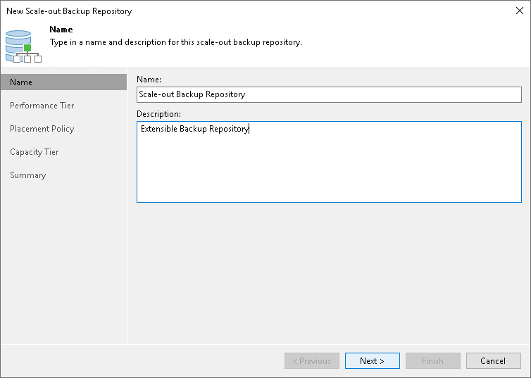

# Step 2. Specify Scale-Out Backup Repository Name

In this article

At the Name step of the wizard, specify a name and description for the scale-out backup repository.

1. In the Name field, specify a name for the scale-out backup repository.
2. In the Description field, provide a description for future reference. The default description contains information about the user who added the backup repository, date and time when the backup repository was added.

Page updated 2/28/2024

Page content applies to build 13.0.1.1071
