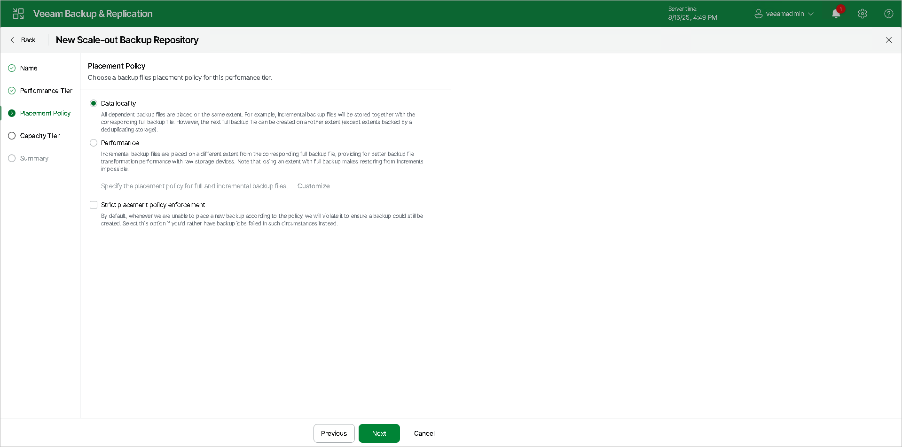

# Step 4. Specify Backup Placement Policy

In this article

[This step is not available if you use object storage repositories as performance extents. For more information on how the backup file placement policy works for performance extents configured using object storage repositories, see [Backup File Placement](backup_repository_sobr_placement.md#extent_selection_objectstorage).]

At the Placement Policy step of the wizard, specify how you want to store backup files on performance extents of the scale-out backup repository.

1. Set the backup file placement policy for the scale-out backup repository:

+ Select Data locality if you want to store backup files that belong to the same backup chain together. In this case, a full backup file and subsequent incremental backup files will be stored to the same performance extent of the scale-out backup repository. The new backup chain may be stored to the same performance extent or to another performance extent (unless you use a deduplicating storage appliance as a performance extent).
+ Select Performance if you want to store full and incremental backup files to different performance extents of the scale-out backup repository. If you set the Performance policy, you must make sure that the network connection is fast and reliable so that Veeam Backup & Replication can access all backup files from the backup chain.

For more information, see [Backup File Placement](backup_repository_sobr_placement.md).

1. If you select the Performance policy, you can restrict which types of backup files can be stored on a specific performance extent. By default, Veeam Backup & Replication stores all types of backup files (full backup files and incremental backup files) in the same extent. If you have added three performance extents to the scale-out backup repository, you may want to store full backup files on one extent and incremental backup files — on the other two extents.

1. Click Customize.
2. In the Backup Placement Settings window, select a performance extent and click Edit.
3. In the Extent Settings window, from the Allowed backup files drop-down list, select the type of backups that you want to store in the extent: All backups, only full backups or only incremental backups.

1. If you select the Strict placement policy enforcement check box, Veeam Backup & Replication will not create a backup if it violates the backup placement policy and may result in that a backup job will fail.

|  |
| --- |
| Note |
| This option is ignored if you either [rebalance extents of your scale-out backup repositories](sobr_rebalance.md) or [evacuate data from scale-out backup repositories](sobr_evacuate.md). |

Page updated 1/5/2026

Page content applies to build 13.0.1.1071
