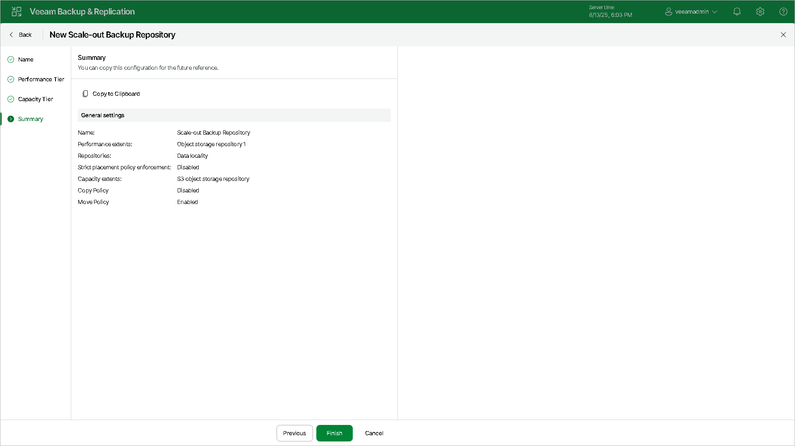

# Step 6. Finish Working with Wizard

At the Summary step of the wizard, complete the procedure of scale-out backup repository configuration.

Wait for the scale-out backup repository to be added to the backup infrastructure. The process may take some time.

1. Review details of the scale-out backup repository.
2. Click Finish to exit the wizard.

