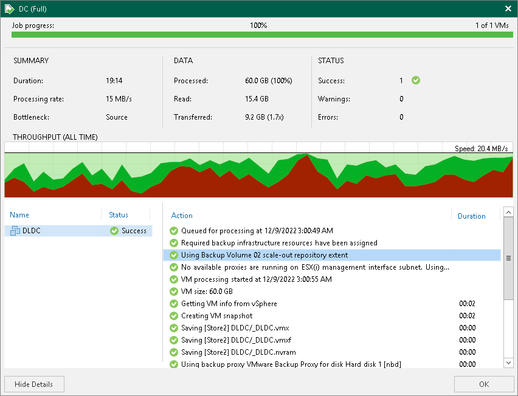
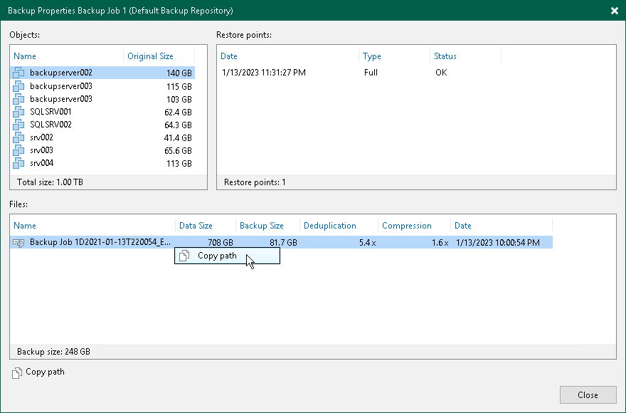

# Discovering Backups in Scale-Out Backup Repositories

To discover on which performance extent of the scale-out backup repository a particular backup file is stored, you can examine the job session statistics or check the backup properties.

Viewing Job Session Statistics

To view the job session statistics:

1. Open the Home view.
2. In the [inventory pane](vbr_ui.md), click Backup under Jobs.
3. In the working area, right-click the job and select Statistics.
4. In the bottom left pane of the window, click the VM name. In the Action pane, locate the message: Using N scale-out repository extent.

Viewing Backup Properties

To view the backup properties:

1. Open the Home view.
2. In the [inventory pane](vbr_ui.md), select Disk under Backups.
3. In the working area, right-click the backup and select Properties.
4. Veeam Backup & Replication will display the extent where the backup file resides in the headline of the Backup Properties window. To see the path to the backup file, right-click the job and select Copy path.

