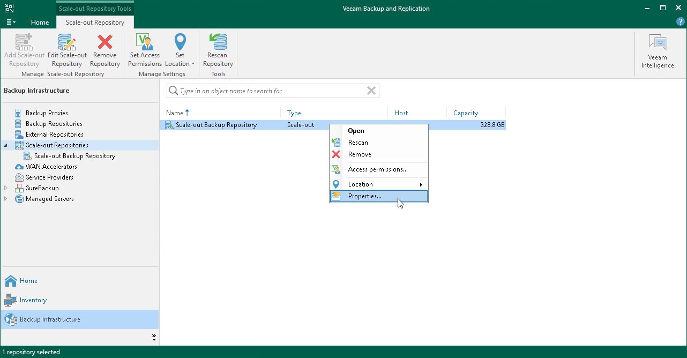

# Editing Settings of Scale-Out Backup Repositories

In this article

You can edit settings of the scale-out backup repository, for example, if you want to change the backup file placement policy or specify other advanced settings for the backup repository.

Consider the following:

* If you enable or disable the Use per-machine backup file option, Veeam Backup & Replication will apply new settings after a new full backup file is created.
* If you enable or disable the Perform full backup when required extent is offline option, Veeam Backup & Replication will apply the new settings starting from the next session of the job targeted at this scale-out backup repository.
* If you change the backup file placement policy settings, Veeam Backup & Replication will apply the new settings starting from the next session of the job targeted at this scale-out backup repository.

To change the scale-out backup repository settings:

1. Open the Backup Infrastructure view.
2. In the inventory pane, click Scale-out Repositories.
3. In the working area, select the scale-out repository and click Edit Scale-out Repository on the ribbon or right-click the scale-out backup repository and select Properties.
4. Follow the steps of the Edit Scale-out Backup Repository wizard and edit settings as required.

Page updated 5/29/2024

Page content applies to build 13.0.1.1071
