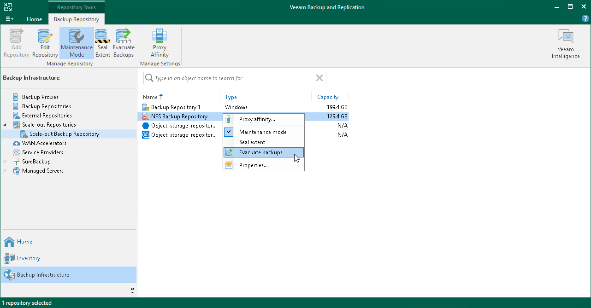
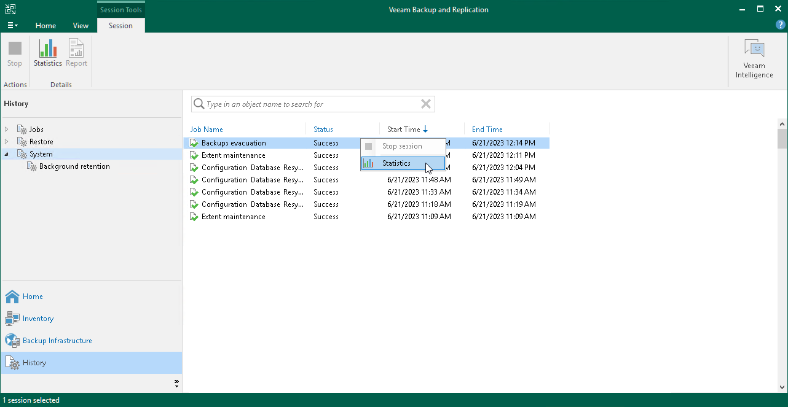
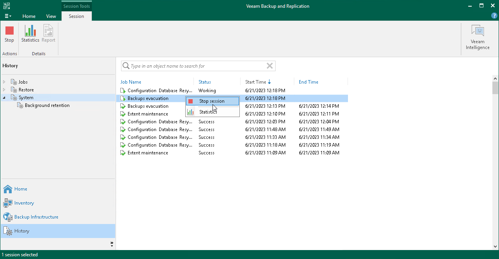

# Evacuating Backups from Extents

If you want to remove an extent from a scale-out backup repository, you first need to evacuate backups from this extent. When you evacuate backups, Veeam Backup & Replication moves backup files from the necessary extent to other extents within the same scale-out backup repository.

You can evacuate data from the following types of extents:

* Performance extents consisting of backup repositories
* Performance extents consisting of direct object storage repositories
* Capacity extents

How Evacuating Backups from Extents Works

Depending on the type of the extent, Veeam Backup & Replication applies different scenario to distribute data between extents during evacuation.

Evacuation from Performance Extents Consisting of Backup Repositories

This scenario applies to data evacuation from performance extents consisting of backup repositories.

When Veeam Backup & Replication selects the target extent for evacuated files, it attempts to follow the backup placement policy specified for remaining extents. For example, you have 3 extents in the scale-out backup repository with the following backup file placement settings:

* On Extent 1, full backup files are stored.
* On Performance Extents 2 and 3, incremental backup files are stored.

If you evacuate backup files from Performance Extent 2, Veeam Backup & Replication will relocate them to Performance Extent 3.

Evacuation from Performance Extents or Capacity Extents

This scenario applies to data evacuation from performance extents or capacity extents.

When Veeam Backup & Replication selects the target extent for evacuated files, it uses multiple conditions to distribute data between extents. Data distribution depends on whether it is the first move or a subsequent move of a backup chain.

To select an extent for backup file placement, Veeam Backup & Replication checks the following conditions:

1. During the first job session, Veeam Backup & Replication checks availability of extents. In case, an extent is set to [Sealed](sobr_seal.md) or [Maintenance](sobr_maintenance.md) mode, these extents will be skipped from backup file placement.
2. After that, Veeam Backup & Replication checks the amount of backup chains in available extents and selects the extent with a minimal amount of backup chains.
3. If some extents have storage space limitations, Veeam Backup & Replication calculates the average storage of the backup chains located in all extents and select the extent that contains a minimum amount of backup chains. If all extents have the same number of backup chains, Veeam Backup & Replication selects the extent that has more free space.
4. During subsequent job sessions, Veeam Backup & Replication moves backup chains to the extent that was specified before.

|  |
| --- |
| Note |
| If an extent is set to Sealed mode or Maintenance mode, Veeam Backup & Replication will not move a backup chain to this extent. In this case, a new extent is selected and Veeam Backup & Replication follows the same algorithm as during the first job session. The backup chain located in an unavailable extent will be moved again to another extent. Veeam Backup & Replication will remove backup chains from the unavailable extents according to [retention policy](capacity_tier_retention.md). |

Considerations and Limitations

Before you start the backups evacuation, consider the following:

* If performance extents consist of repositories with [Fast Clone](backup_repository_block_cloning.md) enabled, Veeam Backup & Replication selects the target extent depending on the whether it contains data blocks that can be reused. In the process of evacuation, Veeam Backup & Replication creates a new backup file in the target extent using these data blocks. Therefore, evacuated backups do not occupy all space in the target performance extent.
* For performance extents that consist of object storage repositories, Veeam Backup & Replication selects the target performance extent as described in section [Extent Selection for Object Storage Repositories Added as Performance Extents](backup_repository_sobr_placement.md#extent_selection_objectstorage).
* If immutability is enabled on the source extent, during evacuation the data blocks are copied to the target extent. The data blocks are removed only when immutability expires.

|  |
| --- |
| Note |
| The data blocks are not removed after immutability expires, if you evacuated these data blocks from object storage repositories added as performance extents of a scale-out backup repository. When the immutability time period is over, you will need to delete these files manually. |

* If you evacuate your backups from a hardened repository that is added as a performance extent, Veeam Backup & Replication will copy these backups instead of moving. For more information, see [Hardened Repository as Performance Extent](hardened_repository_sobr.md#sobr).
* You cannot evacuate data from performance extents that consist of non-object storage backup repositories (for example, [direct attached storage](backup_repository.md#direct), [network attached storage](backup_repository.md#network) or [deduplicating storage appliances](backup_repository.md#dedupe)) to performance extents that consist of direct backup object storage repositories. For this scenario, use the [backup move](backup_moving.md) option.

Evacuating Backups from Extents

Before you evacuate backups from the extent, you must put it into the Maintenance mode. For more information, see [Switching to Maintenance Mode](sobr_maintenance.md).

|  |
| --- |
| Tip |
| If you want to gracefully stop using some of your extents and exclude them from a scale-out backup repository configuration, consider using the [Sealed mode](sobr_seal.md) instead of evacuating backups. |

To evacuate backup files from an extent:

1. [Recommended] Stop and disable jobs targeted at the extent from which you plan to evacuate backups.
2. Open the Backup Infrastructure view.
3. In the inventory pane, select the scale-out backup repository under Scale-out Repositories.
4. In the working area, select the extent and click Maintenance Mode on the ribbon. Alternatively, you can right-click the extent and select Maintenance mode.
5. Select the extent and click Evacuate Backups on the ribbon. Alternatively, you can right-click the extent and select Evacuate backups.
6. If you have disabled jobs, enable them.
7. After you evacuate backups, you can proceed to removing the extent from the scale-out backup repository. For more information, see [Removing Performance Extents from Scale-Out Repositories](sobr_remove_extent.md).

Monitoring Evacuating Backups

To monitor backups evacuation, do the following:

1. Open the History view.
2. In the inventory pane, click System.
3. In the working area, select the evacuation session and click Statistics on the ribbon or right-click the evacuation session and select Statistics.

Stopping Evacuating Backups

You can stop the ongoing evacuation process.

Evacuation cannot be stopped immediately. If you stop evacuation in the middle of moving a large backup file, Veeam Backup & Replication requires additional time to complete the process. Backup files that were not moved to a new extent remain on the current extent.

To stop backups evacuation, do the following:

1. Open the History view.
2. In the inventory pane, click System.
3. In the working area, select the evacuation session and click Stop session on the ribbon or right-click the evacuation session and select Stop session.

