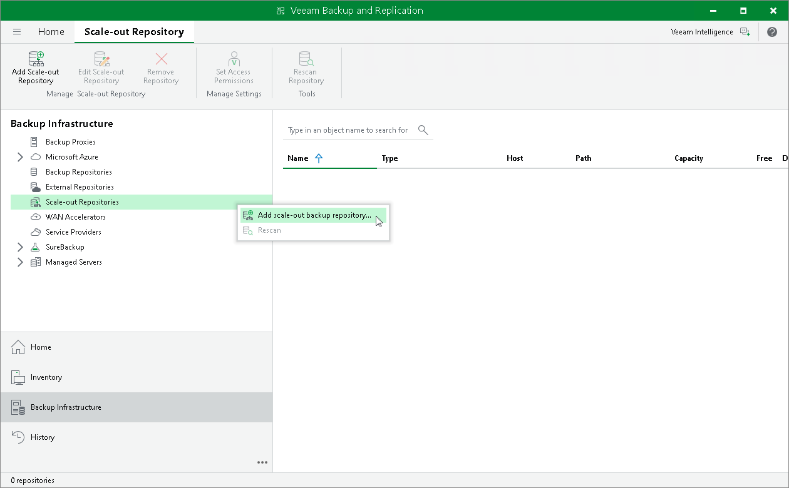

# Step 1. Launch New Scale-Out Backup Repository Wizard

To launch the New Scale-out Backup Repository wizard, do one of the following:

* Open the Backup Infrastructure view. In the inventory pane select Scale-out Repositories and click Add Scale-out Repository on the ribbon.
* Open the Backup Infrastructure view. In the inventory pane right-click Scale-out Repositories and select Add Scale-out Backup Repository.

