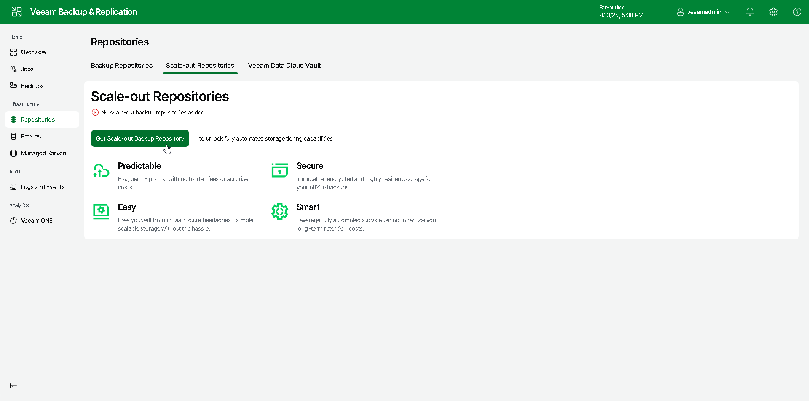

# Step 1. Launch New Scale-Out Backup Repository Wizard

To launch the New Scale-out Backup Repository wizard using web UI, in the working area, select the Scale-out Repositories tab, and click Get Scale-out Backup Repository.

