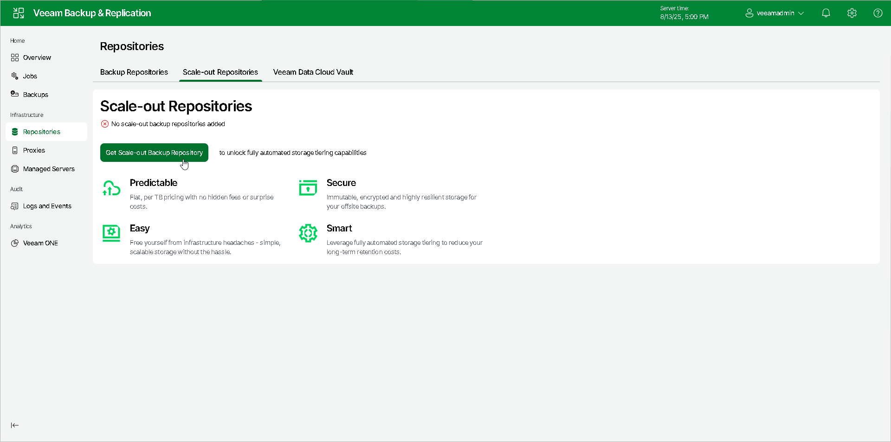

# Step 1. Launch New Scale-Out Backup Repository Wizard

To launch the New Scale-out Backup Repository wizard, do the following:

1. Open the Repositories node in the management pane.
2. Select the Scale-out Repositories tab
3. Click Get Scale-out Backup Repository.

