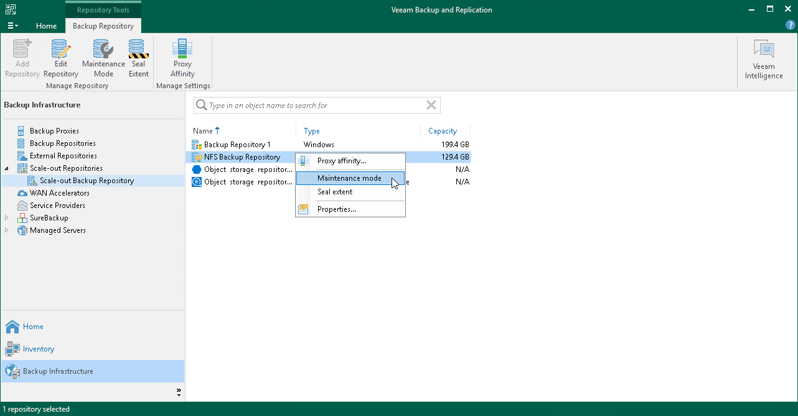

# Switching to Maintenance Mode

Maintenance Mode

Veeam Backup & Replication allows you to put any of the scale-out backup repository extents into the Maintenance mode. You can use this mode if you need to perform service actions, such as upgrading an extent or installing a patch on it. Putting an extent into the Maintenance mode is mandatory to evacuate backups, as described in section [Evacuating Backups from Extents](sobr_evacuate.md).

When you switch to the Maintenance mode, Veeam Backup & Replication launches the Repository Maintenance job. The Repository Maintenance job checks the status of jobs and tasks targeted at the extent and puts the extent to one of the following modes:

* If no tasks using the extent are currently running, the job puts the extent to the Maintenance mode immediately.

* If the extent is busy with any task, for example, a backup job, the job puts the extent to the Maintenance pending state and waits for the task to complete. When the task is complete, the extent is put to the Maintenance mode.

Considerations and Limitations

Consider the following limitations:

* When you put an extent into the Maintenance mode, Veeam Backup & Replication restricts any further data transfer to the extent and allows only operations listed in section [Maintenance mode restrictions](#limitations).
* An extent can be put into both the Maintenance and the Sealed modes at the same time. When both modes are applied, [Maintenance mode restrictions](#limitations) override [restrictions of Sealed mode](sobr_seal.md#limitations).

* You cannot restore VM data from backup files residing on the extent. You also cannot restore VM data from backup files residing on other extents if a part of the backup chain resides on the extent in the Maintenance mode.
* If an extent contains a part of an active backup chain on it, do NOT put this extent into the Maintenance mode. Otherwise, the backup job targeted to the scale-out backup repository will fail. To avoid this, create a full backup manually.

Putting Extent to Maintenance Mode

To put an extent into the Maintenance mode:

1. Open the Backup Infrastructure view.
2. In the inventory pane, select the scale-out backup repository under Scale-out Repositories.
3. In the working area, select the extent and click Maintenance Mode on the ribbon or right-click the extent and select Maintenance mode.

To remove the extent from the Maintenance mode, select the extent and click Maintenance Mode on the ribbon or right-click the extent and select Maintenance mode once again.

Maintenance Mode Restrictions

The following table lists restrictions that are imposed right after the necessary extent of a scale-out backup repository is put into Maintenance mode.

| Activity | Restriction Level |
| --- | --- |
| Moving to object storage. | Restricted |
| Copying to object storage. | Restricted |
| Downloading from object storage. | Restricted |
| Moving to capacity tier (manual operation). | Restricted |
| Copy to performance tier (manual operation). | Restricted |
| Restore from offloaded backups. | Restricted |
| Export as .vbk from offloaded backups. | Restricted |
| Removal of backups or VMs created with the per-machine method. | Restricted |
| Scale-out backup repository rescan. | Allowed |
| Removal of backups from configuration. | Allowed |
| Evacuation of storage along with indexes from on-premises extents. | Allowed |

Related Topics

[Switching to Sealed Mode](sobr_seal.md)

