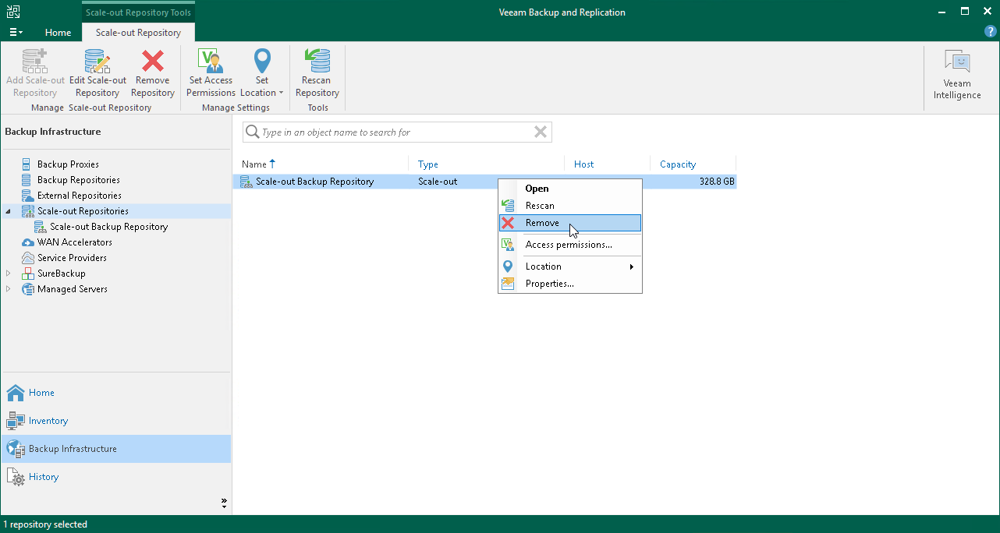

# Removing Scale-Out Backup Repositories

You can remove a scale-out backup repository at any time. When you remove a scale-out backup repository, Veeam Backup & Replication unassigns the extent role from all the backup repositories configured into it, and they become individual backup repositories. Backup files are not removed from the backup repositories — they remain on the disk or an object storage repository.

You cannot remove a scale-out backup repository if at least one job is targeted at it. First, you must move all backup files to the new backup repository and then retarget the jobs. For details, see [this Veeam KB article](https://www.veeam.com/kb2236).

To remove a scale-out backup repository:

1. Open the Backup Infrastructure view.
2. In the inventory pane, click Scale-out Repositories.
3. In the working area, select the scale-out repository and click Remove Repository on the ribbon or right-click the backup repository and select Remove.

