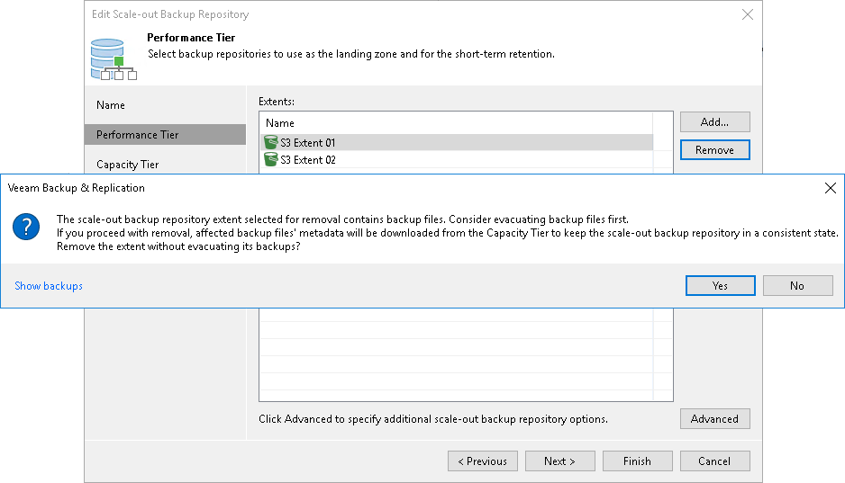

# Removing Performance Extents from Scale-Out Repositories

You can remove a performance extent from the scale-out backup repository, for example, if you do not want to store backup files on the underlying storage anymore. When you remove a performance extent, Veeam Backup & Replication puts the relevant backup repository to the Maintenance mode and unassigns the performance extent role from it. The backup repository ceases to exist as a part of the scale-out backup repository and becomes an individual backup repository.

If the performance extent contains backup files, it is strongly recommended that you perform the following actions before you remove the extent:

1. Put the performance extent to the [Maintenance mode](sobr_maintenance.md).
2. Evacuate backups from the extent. For more information, see [Evacuating Backups from Extents](sobr_evacuate.md).

In this case, backup files will be moved to other performance extents of the scale-out backup repository, and the backup chain will remain consistent. If you do not evacuate backups from the performance extent, the backup chain may get broken as some restore points will be missing from it.

To remove a performance extent from the scale-out backup repository:

1. Open the Backup Infrastructure view.
2. In the [inventory pane](vbr_ui.md), click Scale-out Repositories.
3. In the working area, select the scale-out backup repository and click Edit Scale-out Repository on the ribbon or right-click the scale-out backup repository and select Properties.
4. Move to the Performance tier step of the wizard.
5. In the Extents list, select the performance extent and click Remove.

If the performance extent contains backup files, Veeam Backup & Replication will suggest evacuating them. To evacuate files, click No, close the wizard and evacuate backup files. For more information, see [Evacuating Backups from Extents](sobr_evacuate.md).

If you do not want to evacuate the backup files, click Yes and proceed with the wizard.

