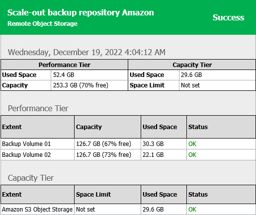
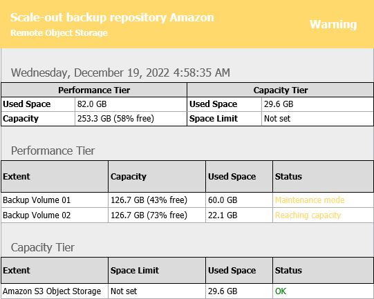
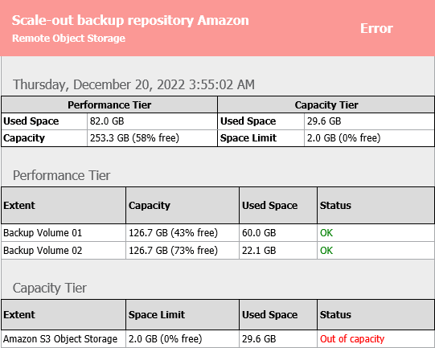

# Receiving Scale-Out Backup Repository Reports

In this article

Veeam Backup & Replication is capable of sending reports that contain information about processing results of your scale-out backup repositories data.

Consider the following:

* Reports are sent only after you have enabled and configured email notifications, as described in section [Configuring Global Email Notification Settings](general_email_notifications.md).
* Reports are sent daily at time specified in global notification settings.
* Reports are sent for all notification types selected in global notification settings, such as Success, Warning and Failure.
* The title of a report is built up of "Scale-out Backup Repository" + a repository name. That said, if your scale-out backup repository name is Amazon, then the report title will be Scale-out Backup Repository Amazon.

Each report is divided into sections and contains the following information:

* Performance Tier (upper-left) section:

+ Used Space. Shows the used disk space of your scale-out backup repository.
+ Capacity. Shows the total storage capacity of your scale-out backup repository.

* Capacity Tier (upper-right) section:

+ Used Space. Shows the occupied storage space in your object storage repository.
+ Space Limit. Shows the space limit (if any). A space limit is specified when adding a new object storage repository, as described in section [Adding Object Storage Repositories](new_object_storage.md).

* Performance Tier (middle) section:

+ Extent. Shows extents of a scale-out backup repository.
+ Capacity. Shows the total storage capacities of your performance extents.

+ Used Space. Shows the amount of disk space used on your extents.
+ Status. Shows the status of each extent, as described in section [Description of Report Statuses](#sd).

* Capacity Tier (lower) section:

+ Extent. Shows the name of the capacity extent.

+ Space Limit. Shows the space limit (if any).
+ Used Space. Shows the occupied storage space in your capacity extent.

+ Status. Shows the status of the capacity extent, as described in section [Description of Report Statuses](#sd).

If an automatic offload job session exits with any status other than Success, you will see the associated status message in this field. For more information about the offload job, see [Moving Backups to Capacity Tier](capacity_tier_move.md).

Description of Report Statuses

The following table lists possible combinations of Warning and Error messages shown under the Status column of a report.

If none of the conditions listed in the Extent state column is true, then the report status will be shown as Success.

| Extent type | Extent state | Status message | Report type |
| --- | --- | --- | --- |
| Performance tier | Maintenance mode | Maintenance mode | Warning |
| Threshold limit exceeded. Threshold is specified in the Backup storage section, as described in section [Specifying Global Notification Settings](global_notifications.md). | Reaching capacity | Warning |
| Unavailable | Offline | Error |
| Capacity tier | Maintenance mode | Maintenance mode | Warning |
| Space limit exceeded. Space limit is specified when adding a new object storage repository, as described in section [Adding Object Storage Repositories](new_object_storage.md). | Out of capacity | Error |
| Unavailable | Offline | Error |
| Threshold limit exceeded. Threshold is specified in the Backup storage section, as described in section [Specifying Global Notification Settings](global_notifications.md). | Reaching capacity | Warning |

Report Examples

Success Reports

The following figure shows an example of a report consisting of two performance extents (Backup Volume 01 and Backup Volume 02); both share 253.3 GB of storage capacity, of which 52.4 GB is occupied.

Both extents have OK status, which means that neither extent was put into the Maintenance mode, nor has any of these performance extents exceeded the allowed threshold limit.

This report also includes the Capacity Tier section consisting of a capacity extent with no Space Limit applied. This capacity extent stores 29.6 GB of data and has the OK status.

Warning Reports

The following figure demonstrates a report with the Warning status.

As per example, the Backup Volume 01 performance extent has been put into the Maintenance mode, and the Backup Volume 02 performance extent has exceeded the allowed threshold both of which have caused a report to be generated with the Warning status.

Error Reports

In the following figure, a report has been generated with the Error status caused by the Amazon S3 Object Storage performance extent which has exceeded its allowed space limit.

Related Topics

[Viewing Capacity Tier Sessions Statistic](offload_session_results.md)

Page updated 7/31/2025

Page content applies to build 13.0.1.1071
