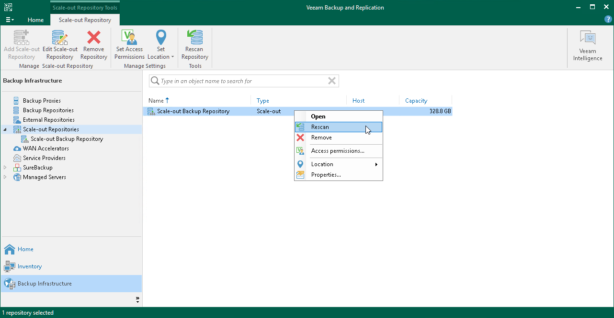
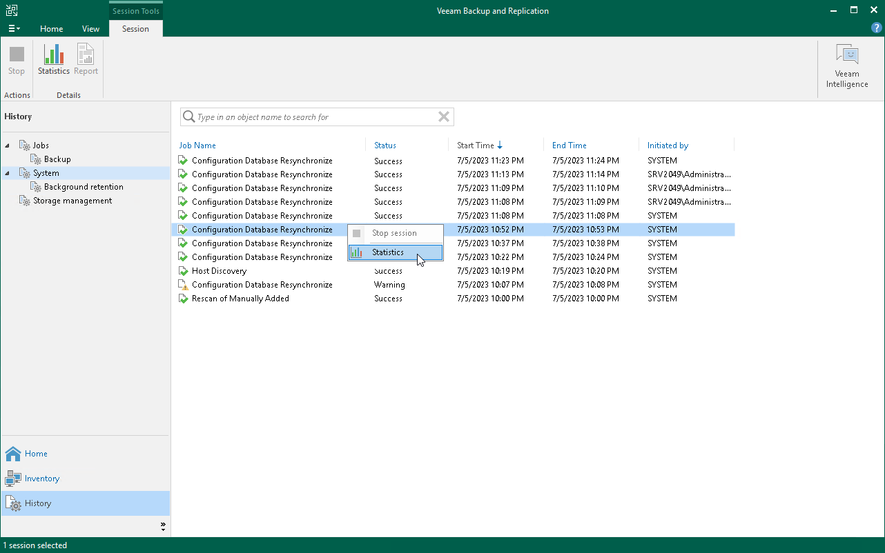

# Rescanning Scale-Out Repositories

Veeam Backup & Replication periodically rescans scale-out backup repositories. During the rescan process, it gets the following information:

* State of every performance extent added to the scale-out backup repository: online or offline.
* Status of Veeam Data Movers on extents: up-to-date or outdated.
* Space available in the scale-out backup repository.

The rescan operation is performed automatically by a rescan process that works permanently in the background. The process is started every 24 hours. It can be also started when a new task session starts, and the Veeam Backup Service requires information about the infrastructure to be refreshed.

In addition to the automated rescan process, you can manually start rescan of the scale-out backup repository. Backup repository rescan may be helpful, for example, if you want to discover backup files that were manually relocated from one performance extent to another one.

Consider the following:

* Information about backup files location is updated only if you perform manual rescan of scale-out backup repositories.
* Veeam Backup & Replication rescans scale-out backup repositories when you perform backup files import.
* Veeam Backup & Replication does not rescan extents that are set into the Maintenance mode.
* To successfully rediscover relocated backups files created by backup copy jobs, make sure to disable these jobs manually prior to rescanning.

For more information, see [Disabling and Deleting Jobs](disabling_jobs.md).

To start the rescan process:

1. Open the Backup Infrastructure view.
2. In the inventory pane select Scale-out Repositories.
3. In the working area, select the scale-out repository and click Rescan Repository on the ribbon or right-click the scale-out backup repository and select Rescan.

Checking Rescan Sessions Reports

If necessary, you can view a history of all rescan reports that Veeam Backup & Replication ran for scale-out backup repositories (both automatic and manual).

To do it, perform the following steps:

1. Open the History view.
2. In the inventory pane, select Statistics.
3. In the working area, select the necessary task session and click Statistics on the ribbon. You can also right-click the necessary session and select Statistics.

