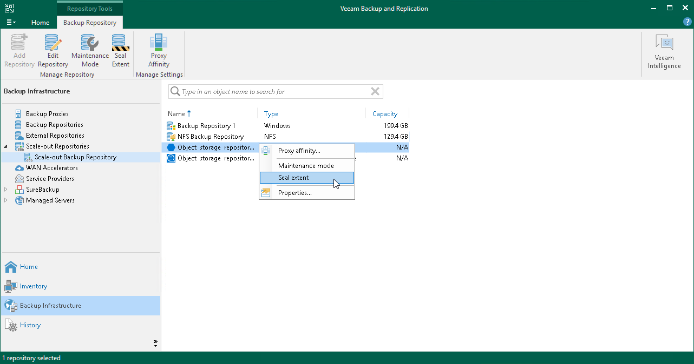

# Switching to Sealed Mode

Veeam Backup & Replication allows you to put any of the scale-out backup repository extents into the Sealed mode.

Sealing up scale-out backup repository extents allows you to gradually remove data located on these extents by applying a retention policy. You can use this feature to gracefully stop using some of your extents and exclude them from the scale-out backup repository configuration.

After the extent is sealed, no further data is saved to the extent, and only read operations such as restore, merge and remove are allowed.

Backup jobs that are targeted to a scale-out backup repository with the sealed extents that store active backup chains are forced to create a new active full backup on the next run. Veeam Backup & Replication saves the new active full to another available extent in the scale-out backup repository scope and forms a new active backup chain. To select an extent where to keep the new active full, Veeam Backup & Replication compares available resources of all extents and selects the best suitable extent.

|  |
| --- |
| Note |
| Consider the following:   * If you create backup jobs with the help of another Veeam backup solution, you will have to trigger active full backup job manually. * If you use the per-machine backup chain format for backed-up data, the active full is forced only for machines which backups have active chains on the sealed extents. |

Considerations and Limitations

Consider the following limitations:

* All restore points that exceed the specified retention period will be continuously removed from the sealed extents on each subsequent backup session.

* When you put an extent into the Sealed mode, Veeam Backup & Replication restricts any further data transfer to the extent. For more information on operation restrictions, see [Sealed Mode Restrictions](#limitations).

* All restore points that exceed the specified retention period will be continuously removed from the sealed extent, as described in section [Retention Policy](capacity_tier_retention.md).
* An object storage repository can be put into Sealed mode only if it is a member of the scale-out backup repository.

If an object storage repository was not added as part of any of your scale-out backup repositories, the Seal Extent option will not be available.

* An extent can be put into both the Maintenance and the Sealed modes at the same time.

When both modes are applied, the Maintenance mode overrides Sealed mode.

To put an extent into the Sealed mode:

1. Open the Backup Infrastructure view.
2. In the inventory pane, select the scale-out backup repository under the Scale-out Repositories node.
3. In the working area, select the extent and click Seal extent on the ribbon or right-click the extent and select Seal extent.

To remove the extent from the Sealed mode, select the extent and click Sealed on the ribbon or right-click the extent and select Sealed.

Sealed Mode Restrictions

The following table lists restrictions that are imposed right after the extent is put into Sealed mode.

| Activity | Restriction Level |
| --- | --- |
| Moving backups to object storage | Restricted |
| Copying backups to object storage | Restricted |
| Moving backups to capacity tier (manual operation) | Restricted |
| Downloading data from object storage | Allowed |
| Copying backups to performance tier (manual operation) | Allowed |
| Moving backups to performance tier (manual operation) | Allowed |
| Restoring data from backup files residing on object storage | Allowed |
| Exporting as .VBK file from backup files residing on object storage | Allowed |
| Removing backups from configuration | Allowed |
| Retention policies | Allowed |
| Removing backups or VMs created with the per-machine method | Allowed |
| Removing a VM from a single storage | Allowed |
| Scale-out backup repository rescan | Allowed |
| Evacuating backups | Allowed |

Related Topics

* [Short-Term Retention Policy](retention_policy.md)
* [Switching to Maintenance Mode](sobr_maintenance.md)

