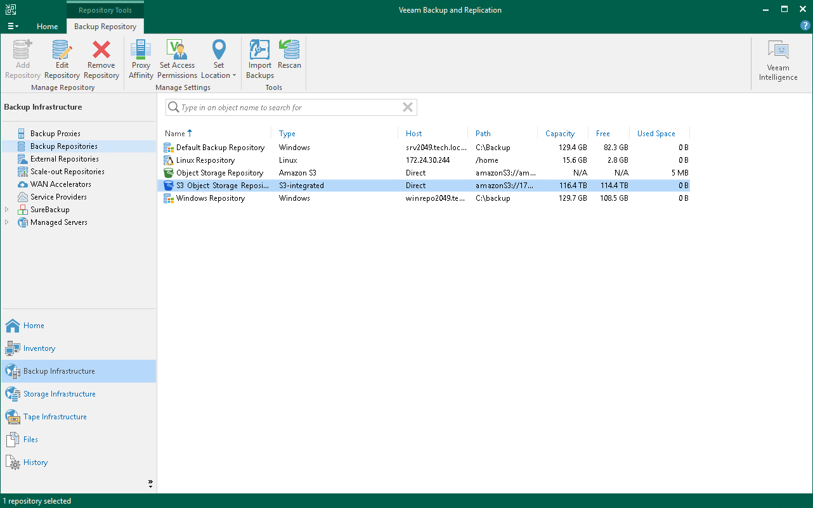

# Working with Veeam Smart Object Storage API (SOSAPI)

In this article

Veeam Backup & Replication offers Veeam Smart Object Storage application programming interface (SOSAPI) functionality to interact with S3 compatible object storage repositories. Object storage vendors can leverage SOSAPI to decrease impact on the production environment, significantly improve recovery point objective (RPO) and optimize the interaction between object storage and Veeam Backup & Replication. SOSAPI relies on Amazon S3 API protocol, uses its authorization mechanisms and existing S3 API calls. This approach does not require to set up a complex network infrastructure - there is no need to create additional ports, firewall rules or install any plug-ins. Instead, vendors need to handle the API requests to interact with [S3 compatible](s3_compatible_adding.md) and [S3 compatible with Data Archiving](compatible_glacier_add.md) object storage repositories.

Among others, SOSAPI functionality suggests taking advantage of the following options:

* Capacity reports

Veeam Backup & Replication sends a warning if space capacity of an object storage repository reaches its limits. Also, you can check the amount of free space available in the object storage repository using Veeam Backup & Replication UI. For more information, see [Editing Settings of Backup Repositories](backup_repo_edit.md).

* Enhanced scale-out backup repository placement policy

In case you use multiple extents within the scale-out backup repository, Veeam Backup & Replication will select the best extent to keep the backup data evenly.

* Load balancing on smart entity level

A vendor can implement internal load balancing for SOSAPI-enabled repositories.

This option defines that Veeam Backup & Replication will be able to perform read and write task with the necessary repositories using a set of vendor-defined IP addresses instead of only one endpoint address.

Working with SOSAPI

To start working with SOSAPI, vendors must add to their object storage infrastructure a set of XML configuration files. Veeam Backup & Replication will automatically enable SOSAPI functionality supported by the vendor and provide necessary capabilities to customers. After you add the S3 compatible or S3 compatible with Data Archiving object storage repositories with SOSAPI functionality to the backup infrastructure, it will show up as the S3-integrated type in working area.

How SOSAPI Works

To interact with object storage, SOSAPI uses API requests. It sends API requests to S3 compatible object storage repository and gets the necessary information in a set of XML files. These files contain details on the system, object storage repository capacity and correct storage usage, object storage capabilities and a state of the backup processing. Therefore, the SOSAPI functionality allows you to maintain the efficient state of the object storage repository and protect your backup infrastructure from data loss.

You can use SOSAPI functionality for advanced interaction with backups created by the following types of jobs and policies:

* Backups of VMware vSphere virtual machines created by Veeam Backup & Replication.
* Backups of file shares created by Veeam Backup & Replication.
* Backups of virtual and physical machines created by Veeam Agent for Microsoft Windows or Veeam Agent for Linux.

* Backups of Nutanix AHV virtual machines created by [Veeam Plug-In for Nutanix AHV](https://helpcenter.veeam.com/docs/vbahv/userguide/overview.html?ver=9).

* Backups of oVirt VMs created by [Veeam Backup for OLVM and RHV](https://helpcenter.veeam.com/docs/vbrhv/userguide/overview.html?ver=7).
* Backups of Proxmox VE VMs created by [Veeam Plug-In for Proxmox VE](https://helpcenter.veeam.com/docs/vbproxmoxve/userguide/overview.html?ver=3).

* Backups stored in S3 compatible object storage repositories of Service Providers.

|  |
| --- |
| Note |
| This option works only if a tenant connects to the object storage through a gateway server. For more information, see the [Backup to Object Storage](https://helpcenter.veeam.com/docs/vbr/cloud/cc_object_storage.html?ver=13) section in the Veeam Cloud Connect Guide. |

Page updated 11/13/2025

Page content applies to build 13.0.1.1071
