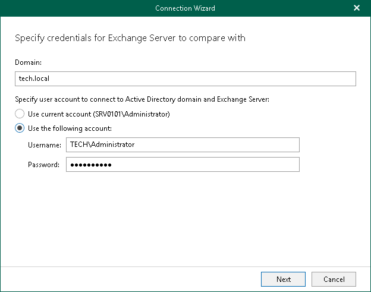

# Step 1. Specify Domain and Credentials

In this article

At this step of the wizard, enter a domain name where your CAS server resides and provide credentials.

Page updated 10/6/2025

Page content applies to build 13.0.1.1071
