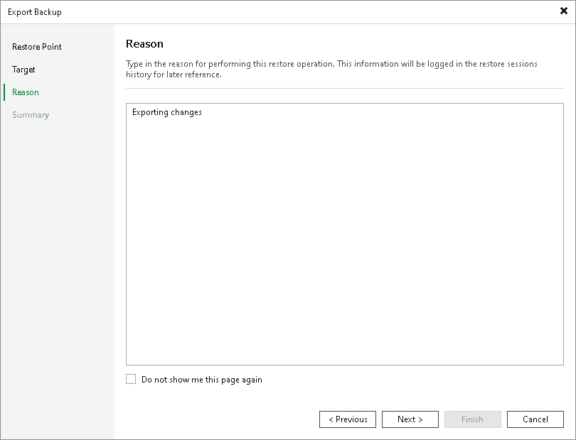

# Step 4. Specify Export Reason

At the Reason step of the wizard, provide the reason for restore.

|  |
| --- |
| Tip |
| If you do not want to show this page, select the Do not show me this page again check box. If you want to unhide this page, follow the instructions described in [this Veeam KB article](https://www.veeam.com/kb4432). |

