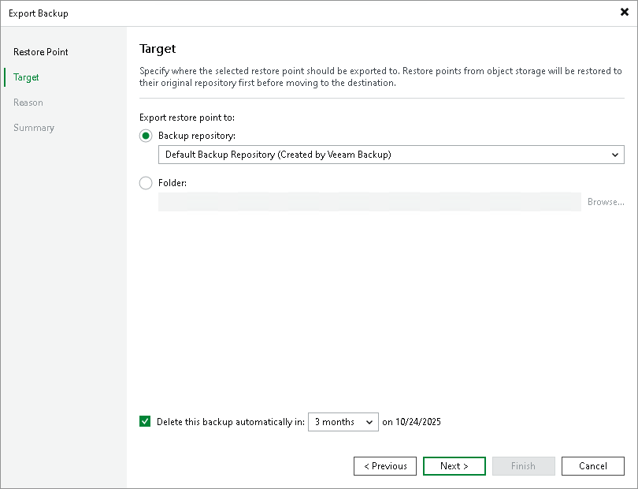

# Step 3. Specify Destination

In this article

At the Target step of the wizard, do the following:

1. In the Export restore point to area, choose whether you want to export restore points to a backup repository or to a local or shared folder.
2. If prompted, in the Credentials window, specify the credentials of the user account to access the target location.
3. To automatically delete the exported files after the specified period of time, select the Delete exported backup file automatically check box and specify the period. The exported files will be removed at 12:00:00 AM on the next day after the retention period ends.

|  |
| --- |
| Tip |
| You can customize retention period values in the drop-down list as described in [this Veeam KB article](https://www.veeam.com/kb4537). |

Page updated 2/8/2024

Page content applies to build 13.0.1.1071
