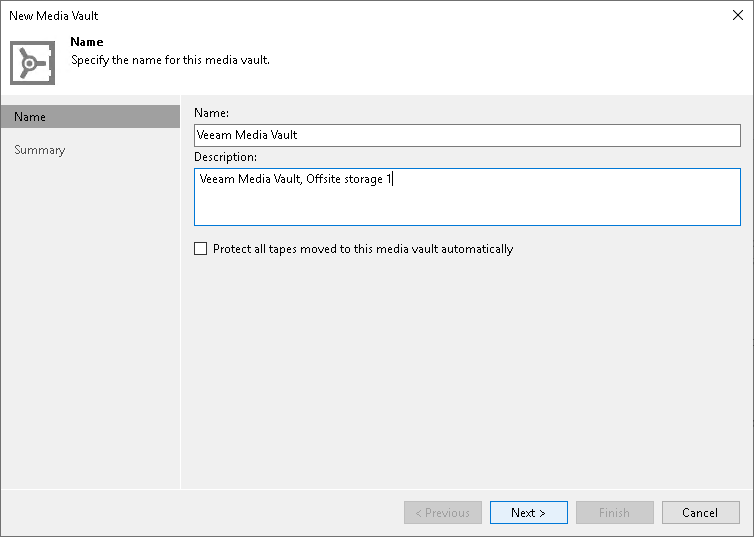

# Step 2. Specify Media Vault Name

In this article

At the Name step of the wizard, you should define basic description for the new vault.

1. In the Name field, enter a name for the created vault.
2. In the Description field, enter a description of the new vault. The default description contains information about the user who created the vault, date and time when the vault was created.
3. If you want to set overwrite protection to all tapes in this vault, select the Protect all tapes moved to this media vault automatically check box. For more information, see [Tape Protection](tape_protection.md).

Page updated 5/20/2025

Page content applies to build 13.0.1.1071
