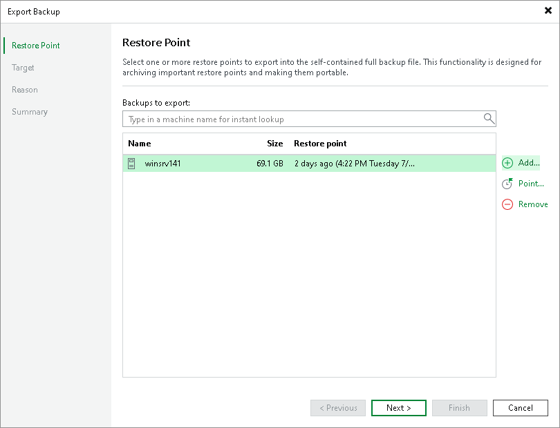

# Step 2. Select Restore Points to Export

In this article

At the Restore Point step of the wizard, do the following:

1. Click Add to select a VM, the restore points of which you want to transform into full backup files.

1. In the Backups Browser dialog box, select a backup job or virtual machine.

When selecting a backup job consisting of multiple machines, each machine will be exported as an independent full backup file.

1. In the Backups to export list, select a VM and click Point to choose a restore point that you want to transform into a full backup file.

Page updated 7/4/2025

Page content applies to build 13.0.1.1071
