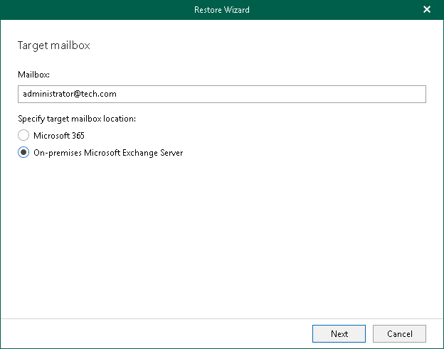

# Step 2. Specify Target Mailbox

At this step of the wizard, specify the target mailbox and mailbox location.

To specify mailbox settings, do the following:

1. In the Mailbox field, enter a mailbox name to which you want to restore data.
2. Select On-premises Microsoft Exchange Server to restore the specified mailbox to an on-premises Microsoft Exchange organization. For more information, see the [Adding On-Premises Microsoft Organizations](https://helpcenter.veeam.com/docs/vbo365/guide/vbo_add_onpremises_org.html?ver=80) section of the Veeam Backup for Microsoft 365 User Guide.

You can also restore from backups created for on-premises Microsoft Exchange organizations to Exchange Online organizations and vice versa. For more information, see [Restore to Microsoft 365 Organizations](restore_to_o365.md).

