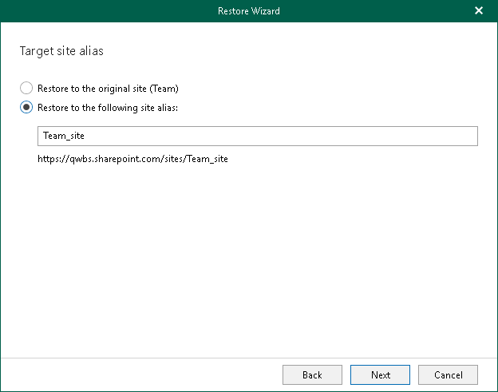

# Step 4. Specify Target Site Alias

In this article

This step is only available if you restore subsites or site collections from backups created by Veeam Backup for Microsoft 365 with the Group#0 or SITEPAGEPUBLISHING#0 template. These are subsites, team sites with modern authentication or communication sites with modern authentication. For sites with different template, such as personal sites or other sites, this step is unavailable. You proceed to the [Specify Restore Options](vesp_specify_restore_options_sites.md) step.

At this step of the wizard, specify a target site alias that you want to use for data restore.

|  |
| --- |
| Note |
| When restoring site collections other than site collections with the Group#0 or SITEPAGEPUBLISHING#0 template, make sure that such collections exist in the target location; Veeam Explorer for Microsoft SharePoint does not create site collections. |

Page updated 10/6/2025

Page content applies to build 13.0.1.1071
