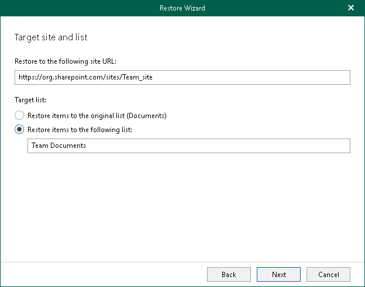

# Step 5. Specify Target Site and List

At this step of the wizard, specify web address of a target SharePoint site and select whether you want to restore backed-up data to the original list or specify a custom list.

To specify web address of a target site and a list to restore backed-up data, do the following:

1. In the Restore to the following site URL field, specify web address of a target site.
2. In the Target list section, select one of the following options:

* Restore items to the original list. To restore the document or list item back to the original list.
* Restore items to the following list. To restore the document or list item to the specified list.

Keep in mind that Veeam Explorer for Microsoft SharePoint will not create the list automatically. Make sure you specify a list that exists in the target SharePoint site.

