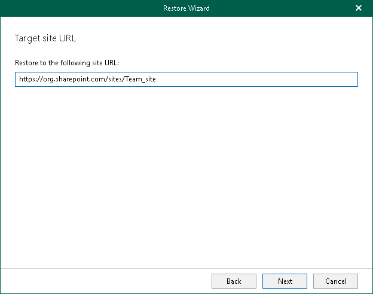

# Step 5. Specify Target Site Web Address

At this step of the wizard, specify web address of a target SharePoint site.

|  |
| --- |
| Note |
| When restoring site collections, make sure that such collections exist in the target location; Veeam Explorer for Microsoft SharePoint does not create site collections. |

