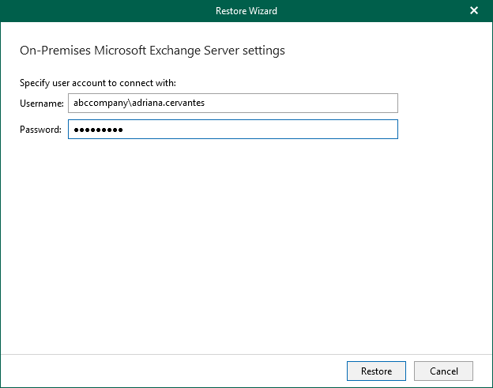

# Step 2. Specify User Account

In this article

At this step of the wizard, specify an account that you want to use to connect to the Exchange server and click Restore.

|  |
| --- |
| Note |
| This step of the wizard is only available in the following cases:   * When the machine where Veeam Explorer for Microsoft Exchange is opened and the Microsoft Exchange server belong to different domains. * When the account used to run Veeam Explorer for Microsoft Exchange does not exist on the domain of the Microsoft Exchange server. |

Page updated 9/19/2024

Page content applies to build 13.0.1.1071
