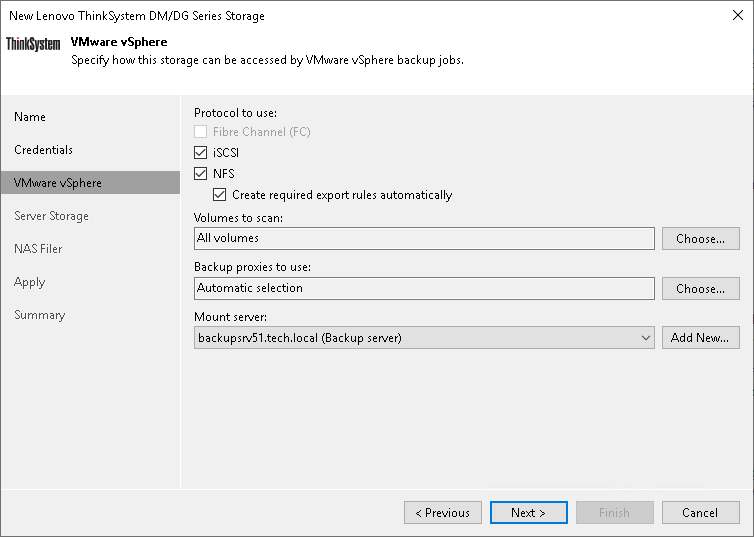

# Step 4. Specify VMware Access Options

In this article

[This step is available for Microsoft Windows-based backup server, and if you have selected the Block or file storage for VMware vSphere check box at the [Specify Lenovo ThinkSystem Server Name or Address](lenovo_add_name.md) step of the wizard.]

At the VMware vSphere step of the wizard, specify options for accessing the storage system.

1. In the Protocol to use section, select check boxes next to protocols over which you want to work with the storage system.
2. [For storage system working over NFS] During storage rescan, backup and restore operations, Veeam Backup & Replication automatically creates required NFS export rules on the storage system. If you do not want Veeam Backup & Replication to create export rules, clear the Create required export rules automatically check box.
3. If you plan to work with specific storage volumes, you can limit the storage rescan scope. In this case, Veeam Backup & Replication will rescan only the volumes that you select. Limiting the rescan scope reduces the amount of time required for the rescan operation.

To select volumes to rescan, click Choose to the right of the Volumes to scan field. In the Edit Volumes window, select volumes you want to rescan:

* To exclude volumes from rescan, select All volumes except and click Add. Click From infrastructure to select volumes from your storage infrastructure, or By wildcard to select volumes using a wildcard character.
* To rescan only specific volumes, select Only the following volumes and click Add. Click From infrastructure to select volumes from your storage infrastructure, or By wildcard to select volumes using a wildcard character.
* If you leave All existing volumes check box selected, Veeam Backup & Replication will rescan all volumes in the storage hierarchy.

After you finish working with the wizard, you can change the rescan scope and start the rescan process manually at any time. For more information, see [Rescanning Storage Systems](storage_rescan.md).

|  |
| --- |
| Important |
| If you plan to use [backup from storage snapshots](backup_from_storage_snapshots.md), you need to make sure that you include in the rescan scope volumes on which VM disks reside. |

1. To rescan storage systems and perform backup from storage snapshots, you need to configure a proxy. On the right of the Backup proxies to use field, click Choose and define proxies that you want to use for these operations.

+ Select Automatic selection to let Veeam Backup & Replication pick a proxy automatically. Veeam Backup & Replication will check which proxies have access to the storage system, and automatically assign an optimal proxy for rescan and backup from storage snapshots.
+ Select Use the selected backup proxy servers only to explicitly select a proxy that must be used for rescan and backup from storage snapshots. It is recommended that you select at least two proxies to ensure that rescan and backup from storage snapshot are performed if one of proxies fails or loses its connectivity to the storage system.

|  |
| --- |
| Important |
| If you select proxies explicitly, you must make sure that you also select these proxies in settings of backup and replication jobs for which you plan to use backup from storage snapshots. If a proxy selected for the job is not added to the list of proxies in the storage system connection settings and the Failover to standard backup option is disabled in the job settings, the job will fail. For more information, see [Configuring Backup from Storage Snapshots](storage_backup.md). |

1. From the Mount Server list, select a server that you want to use as a mount server for file-level and application items restore, or click Add New to add a new one. For more information, see [Mount Server](mount_server.md).

Page updated 10/17/2025

Page content applies to build 13.0.1.1071
