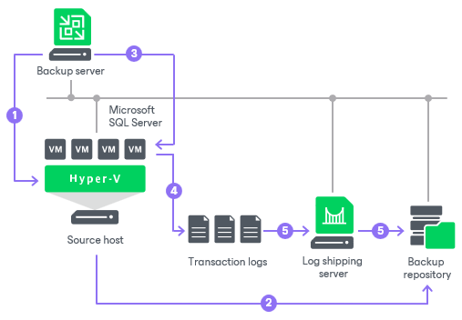

# How Microsoft SQL Server Log Backup Works

In this article

To perform transaction log backup, Veeam Backup & Replication installs the Veeam Guest SQL Log Shipper runtime component on the VM guest OS.

This component runs during the transaction log backup job session and checks the following details:

* Collects information about databases that require transaction log backup.
* Verifies that it is possible to ship logs directly to the backup repository. If it is not possible, Veeam Backup & Replication uses the log shipping server.

When the transaction log backup job session ends, the component is stopped and removed from the VM guest OS. When a new session starts, the component is installed on the VM guest OS again.

The transaction log backup is performed in the following way:

1. Veeam Backup & Replication launches the parent backup job by schedule.
2. The parent backup job creates an image-level backup of a Microsoft SQL Server VM and stores it in a backup repository.
3. A new session of the transaction log backup starts. Veeam Backup & Replication accesses the VM (directly or through the guest interaction proxy) and installs the runtime components for guest processing, database information collection and transaction log handling on the VM guest OS.
4. Veeam Backup & Replication detects what databases currently exist on the Microsoft SQL Server and maps this data with the information kept in the configuration database. This periodic mapping reveals the databases for which Veeam Backup & Replication must process transaction logs during this time interval.

The runtime component backs up transaction log files and stores them as a \*.bak file in a temporary folder on the VM guest file system. For the information on the temporary folder location, see [this Veeam KB article](https://www.veeam.com/kb2642).

1. Veeam Backup & Replication transports transaction log backup copies from the temporary folder on the Microsoft SQL Server VM to the backup repository, either directly or through the log shipping server, and saves them as VLB files. As soon as copies of transaction log backups are saved to the backup repository, transaction log backups in the temporary folder on the Microsoft SQL Server VM are removed.

The session of the transaction log backup job remains working until the next start of the parent backup job. When a new session of the parent job starts, the transaction log backup job stops the current session and then starts a new session, performing steps 1-5.

Transaction logs that, for some reason, were not processed during the log backup interval remain in the temporary folder and are processed during the next log backup interval. To detect these remaining logs, Veeam Backup & Replication enumerates log files in the temporary folder.

|  |
| --- |
| Note |
| Backup of Windows Server Failover clusters is not supported; use Veeam Agent managed by Veeam Backup & Replication instead. For more information, see [Failover Cluster Support](agents_cluster_support.md). |

|  |
| --- |
| Note |
| If a new session of the transaction log backup starts and the parent backup job has not created a new restore point yet, the transaction log backup job will remain in the idle state, waiting for a new restore point to be created. |

Page updated 8/7/2025

Page content applies to build 13.0.1.1071
