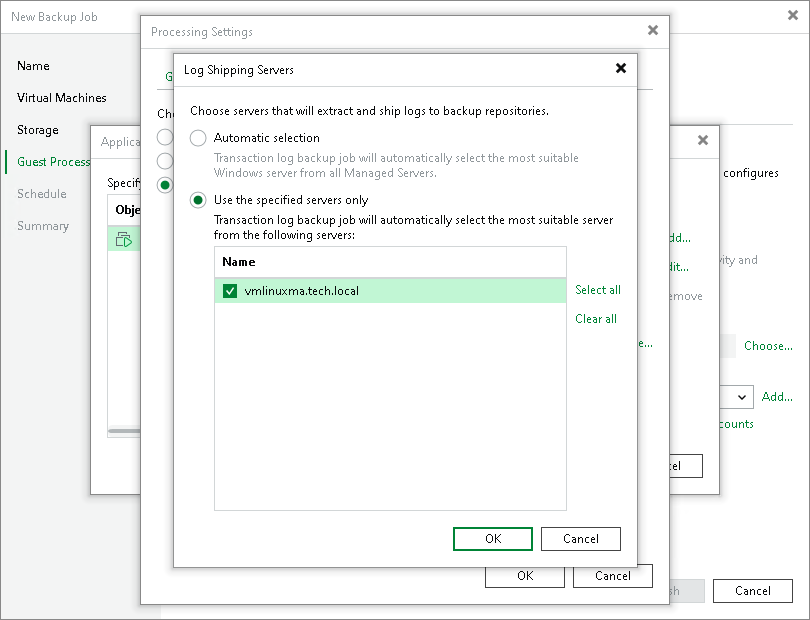

# Log Shipping Servers

For every Microsoft SQL Server VM whose transaction logs you want to back up, Veeam Backup & Replication defines how to ship logs to the backup repository. Transaction logs can be shipped in the following ways:

* Direct connection. If it is possible to establish a direct connection between the VM guest OS and backup repository, log files will be shipped directly from the VM guest OS to the backup repository. This is the optimal method, as it does not involve additional resources and puts less load on the VM guest OS.
* Over log shipping server. If a direct connection is not possible, files will be shipped through log shipping servers. You can instruct Veeam Backup & Replication to choose a log shipping server automatically from the list of available ones or to use a specific server.

Note that if a direct connection is possible, files will always be transferred from VM guest to repository directly (regardless of the configured log shipping server, as this server will not be involved). This approach helps to optimize performance at file transfer.

A log shipping server is a Microsoft Windows or Linux server added to the backup infrastructure. You can explicitly define what servers you want to use for log shipping or instruct Veeam Backup & Replication to automatically choose an optimal log shipping server. Veeam Backup & Replication chooses the log shipping server based on two criteria: possible data transfer methods and location of the Microsoft SQL Server VMs and log shipping server. For more information, see [Location of Log Shipping Server and VMs](#location).

Data Transfer Methods

Log shipping servers can transport data in two ways:

* Over the network. In this scenario, Veeam Backup & Replication obtains files from the VM guest OS and transfers them over the network.

To offload the VM guest OS, logs are created one by one (not simultaneously). One log creation request is issued for every DB.

* Over VIX API/vSphere Web Services. In this scenario, Veeam Backup & Replication obtains transaction logs from the VM guest OS over the VIX API/vSphere Web Services, bypassing the network. For each Microsoft SQL Server instance one log creation request is created for all DBs (grouped by instance).

The default method is log shipping over the network.

Location of Log Shipping Server and VMs

When choosing a log shipping server, Veeam Backup & Replication considers the location of the Microsoft SQL Server VM and log shipping server. Veeam Backup & Replication uses the following priority rules to select the log shipping server:

1. Log shipping server is located on the same ESXi host as the Microsoft SQL Server VM.
2. Log shipping server and Microsoft SQL Server VM are located in the same network.
3. Log shipping server and Microsoft SQL Server VM are located in different networks (the production infrastructure is isolated from the backup infrastructure).

That is, when choosing a log shipping server, Veeam Backup & Replication will give the top priority to a VM that is located on the same ESXi host as the Microsoft SQL Server VM and that has a network connection to the Microsoft SQL Server VM.

Log shipping servers are assigned per job session. When a new job session starts, Veeam Backup & Replication detects log shipping servers anew. Veeam Backup & Replication can also re-detect available servers during the job session. If a log shipping server becomes unavailable for some reason, Veeam Backup & Replication will fail over to another log shipping server.

|  |
| --- |
| Important |
| If you do not want to use some servers for transaction logs transport, you can manually define what server Veeam Backup & Replication must use as a log shipping server in the job settings. It is recommended that you assign the log shipping server role to a number of servers for availability purposes. |

