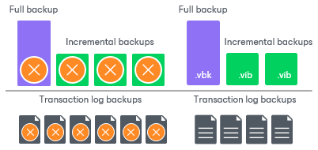
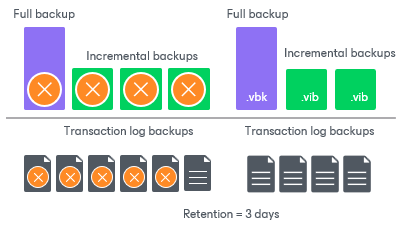

# Retention for Transaction Log Backups

In this article

Transaction log backups are stored in files of the proprietary Veeam format — VLB. Veeam Backup & Replication keeps transaction log backups together with the VM image-level backup. The target location of VLB files depends on the type of the backup repository:

* If you store the VM image-level backup in a backup repository, Veeam Backup & Replication writes transaction log backups to the same folder where files of the image-level backup reside.
* If you store the VM image-level backup in a scale-out backup repository, Veeam Backup & Replication writes transaction log backups to the extent where the latest incremental backup file of the VM image-level backup is stored.

Veeam Backup & Replication removes transaction log backups by retention. You can choose one of the following retention methods:

* [Retain logs according to the image-level backup](#backup)
* [Retain logs for the specified number of days](#days)

Retain Logs with Image-Level Backup

By default, Veeam Backup & Replication retains transaction log backups together with the image-level backup of the Microsoft SQL Server VM. Veeam Backup & Replication retains VM backup and log backups according to the [short-term retention configured for VM backups](retention_policy_hv.md). When Veeam Backup & Replication removes a restore point of the image-level backup from the backup chain, it also removes a chain of transaction logs relating to this image-level backup. Note that even if [long-term retention](gfs_retention_policy_hv.md) is configured for the VM backup, Veeam Backup & Replication retains transaction log backups according to the short-term retention policy and deletes them after the short-term retention is exceeded.

This method allows you to have both the image-level backup and necessary transaction log backups at hand. If you need to recover a database to some state, you can restore the Microsoft SQL Database from the necessary restore point and perform transaction log replay to bring the database to the desired state.

Retain Logs for a Number of Days

You can instruct Veeam Backup & Replication to keep transaction logs only for a specific period. This retention setting can be used, for example, if you want to save on storage space and plan to retain transaction log backups for the last few days. In this case, you will be able to restore the database only to one of the most recent states.

If you select this retention method, you must make sure that retention policies for the image-level backup and transaction log backup are consistent. The restore point of the image-level backup must always be preserved. If a backup of the database itself is missing, you will not be able to perform transaction log replay.

Related Topics

[Microsoft SQL Server Transaction Log Settings](backup_job_vss_sql_hv.md)

Page updated 3/3/2025

Page content applies to build 13.0.1.1071
