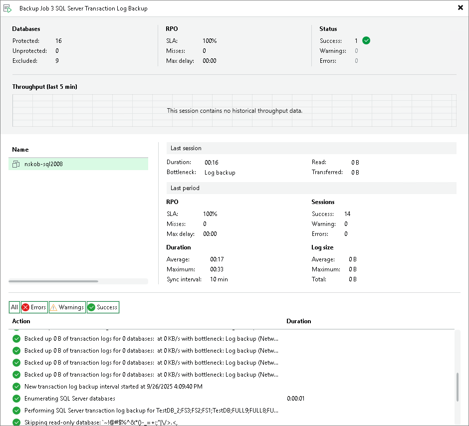
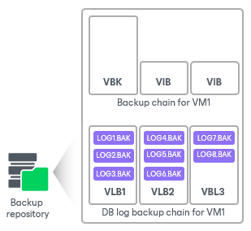

# Transaction Log Backup Statistics

In this article

You can view the statistics of the transaction log backup job in the History view or in the Home view in Veeam Backup & Replication.

In the statistics window, you can examine the overall statistics for the transaction log backup job, as well as view per-VM information.

In the upper part of the statistics window, Veeam Backup & Replication displays information about the transaction log backup job for all VMs included in the parent backup job.

The Last period (all items) section contains statistics data for the selected session of the backup job.

In the Databases column, you can view the following information:

* Protected — number of databases that were backed up at least once during the last session.
* Unprotected — number of databases that failed to be backed up during the last session.
* Excluded — databases excluded from processing. Databases may be excluded for the following reasons:

+ The database status is Offline.
+ The database recovery model is set to Simple.
+ The database is read-only.
+ The database was deleted after the latest full backup.
+ The AutoClose property is enabled for the database.
+ The database was excluded from application-aware processing. For details, see [this Veeam KB article](https://www.veeam.com/kb2110).
+ The database was excluded from SQL log backup processing. For details, see [this Veeam KB article](https://www.veeam.com/kb2104).
+ The database belongs to vCenter Server. For details, see [this Veeam KB article](https://www.veeam.com/kb1051).

|  |
| --- |
| Note |
| Unprotected databases do not comprise Excluded databases, as they have different reasons for being non-processed. |

In the RPO column, you can view the following information:

* SLA value — how many log backup intervals were completed in time with successful log backup (calculated as a percentage of a total number of intervals).
* Misses — how many intervals were missed (number of intervals).
* Max delay — difference between the configured log backup interval and the time actually required for log backup. If exceeded, a warning is issued.

In the Status column, the following information is displayed (per job): number of VMs processed successfully, with warnings or with errors.

The Latest session section displays the following information for the latest log processing interval for the selected VM:

* Duration — duration of log shipment from the VM guest OS to the backup repository since the current log processing interval has started.
* Bottleneck — operation with the greatest duration in the last completed interval. The operation may have the following bottlenecks:

| Display Name | Slowing-down Operation |
| --- | --- |
| Log backup | Saving BAK files to a temporary location on VM guest OS |
| Network | Uploading log files to the log shipping server |
| Target | Saving files to the target repository |

* Read — amount of data read from the temporary folder on VM guest OS.
* Transferred — amount of data transferred to the target repository.

The Last period section displays the following statistics of log backups per VM for the latest session of the transaction log backup job:

* The RPO column displays statistics on the log processing interval.
* The Sessions column includes statistics of log backups per VM, calculated based on their status:

+ Success — number of intervals when all database logs were backed up successfully.
+ Warning — number of sequential intervals with failed log processing (if not more than 4 intervals in a sequence).
+ Errors — number of sequential intervals with failed log processing (more than 4 intervals in a sequence).

* The Duration column includes the following information:

+ Average — average duration of log data transfer (through all intervals in the session).
+ Max — maximal duration of log data transfer (through all intervals in the session).
+ Sync interval — duration of periodic intervals specified for log backup in the parent job settings (default is 15 min).

* The Log size column displays the following information:

+ Average — average amount of data read from the VM guest OS through all intervals.
+ Max — maximal amount of data read from the VM guest OS over all 15-min intervals.
+ Total — total amount of data written to the backup repository.

|  |
| --- |
| Note |
| * Statistics on transaction log processing are updated periodically, simultaneously for the parent backup job and transaction log backup job. * For Always On Availability groups, Veeam Backup & Replication collects logs only from one node. Thus, in reports, the status of database replicas will be the same for all nodes (Protected or Excluded). |

Log Files

At each start of the SQL Server backup job (parent), a new .VLB is created to store log backups in the repository:

* If the Use per-machine backup files option is selected for the repository, then Veeam Backup & Replication will create a separate .VLB for each server processed by the job.
* If this option is cleared, then a single .VLB will be created for all servers processed by the job.

For example, if a job processes only one SQL Server, the repository will contain a number of .VLB files for it (a so-called chain).

As described in the section above, during database log backup (child) job session, transaction log backup is performed by native means of the SQL Server and stored as .BAK file to a temporary folder in the SQL Server VM guest file system. Then, Veeam Backup & Replication copies .BAK file to the current .VLB in the repository. When the new parent job session starts, another .VLB is created, and the .BAK files that appear after that will be stored there during the child job session. The resulting chain of .VLBs will look like the following one, depicted for a single SQL Server VM1:

Total number of all LOG<N>.BAK files stored at the moment in all VLBs is reported as a number of restore points for the child job that backs up database logs. So, in the example above, the log backup job for SQL Server VM1 has created 8 restore points by the moment.

In the Veeam Backup & Replication console, this number of restore points for the log backup job can be seen in the Restore Points column of the preview pane.

Page updated 10/7/2025

Page content applies to build 13.0.1.1071
